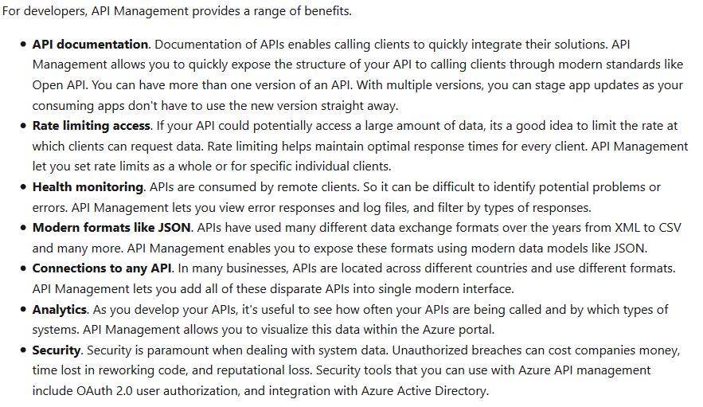
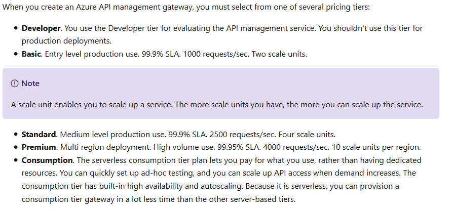
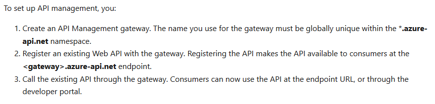
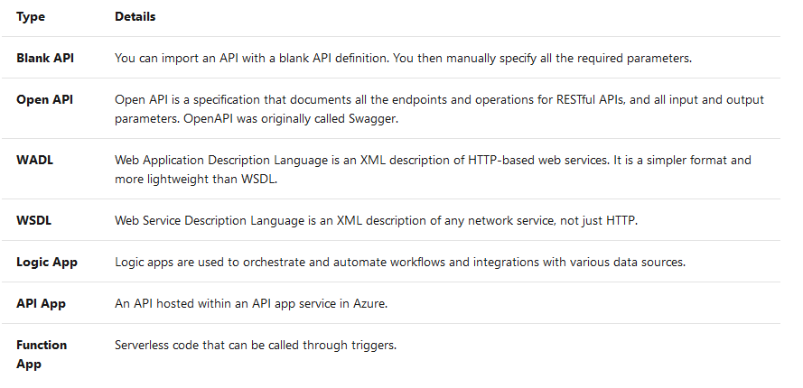
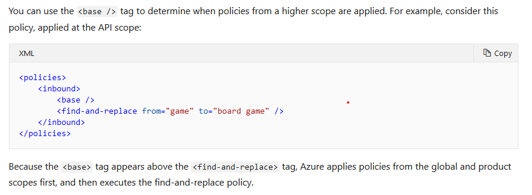
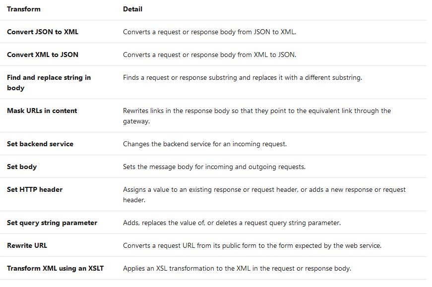
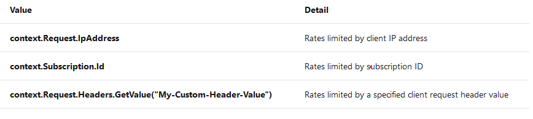

# API intergration

## Publish and manage your APIs with Azure API Management
Azure API Management (APIM) is a fully managed cloud service that you can use to publish, secure, transform, maintain, and monitor APIs. Azure API management is done by **azure api gateway**. An Azure API gateway is an instance of the Azure API management service.

### why use api management

### Pricing tiers

### setup API management

### API framework
API Management provides you with several options for importing APIs.

### Policies
In Azure API Management, administrators can use policies to alter the behavior of APIs through configuration.

Popular configurations include:

- Conversion from XML to JSON
- Call rate limiting to restrict the number of incoming calls.
- Setting inbound and outbound headers
- Policies used for restricting access
- Policies for Authentication

**When do policies execute?**

- Inbound. These policies execute when a request is received from a client.
- Backend. These policies execute before a request is forwarded to a managed API.
- Outbound. These policies execute before a response is sent to a client.
- On-Error. These policies execute when an exception is raised.

**Policy Scopes**
- The global policy scope: Policies applied at the global scope affect all APIs within the instance of API Management.
- The product policy scope. Policies applied at the API scope affect only API within Product. 
- The API policy scope: Policies applied at the API scope affect only a single API(apis from one import). 
- Operation policy scope: Policies applied at the operation scope affect only one operation(function) within the API.

**Which order are policies applied in**

### Product
Products let you group APIs, define terms of use, and runtime policies. API consumers can subscribe to a product on the developer portal to obtain a key to call your API. For all pricing tiers except consumption, there two default products: Starter and Unlimited. The Unlimited product is designed for production API management, as it has no restrictions on the number of attached APIs. You can create as many new products as you need. The starter product has a limit of five API calls/minute, and a maximum of 100 API calls/week.

### Call an API with a subscription key

A subscription key is a unique auto-generated string which needs to be passed through in the headers of the client request.
You could create different subscription and generate the key from it. When creating the subscription, the api(single api,all api, product) could be assossiated to the subscription.
When calling the API, the  Ocp-Apim-Subscription-Key head should be set with the subscription key, otherwise the api call would be rejected.

## add caching to API management
- caching all response
To set up a cache, you use an **outbound** policy named **cache-store** to store responses.  You also use an **inbound** policy named **cache-lookup** to check if there is a cached response for the current request.

- caching part of the response
Use the **cache-store-value** policy to add the value, with an identifying key. Retrieve the value from the cache by using the **cache-lookup-value** policy. If you want to remove a value before it expires, use the **cache-remove-value** policy

- Using vary-by tags
Use the <vary-by-query-parameter> element within the <cache-lookup> policy to make sure that cache is used even some parameter veries.

- why using an external cache
    
    - You want to avoid the cache being cleared when the API Management service is updated.
    - You want to have greater control over the cache configuration than the internal cache allows.
    - You want to cache more data than can be store in the internal cache.

## protect APIs on Azure API Management

### remove the headers that reveals technical stack
e.g. removing the  X-Powered-By filter using policy.
### Transformation policy could be used the remove the important information which could be used by hacker.

### Throttle API requests( limit access to API endpoints)
- Limit by subscription throttling: Subscription throttling allows you to set the rate limits by a specific API operation of a subscription.
- Limit by key(key to identify client like ip) throttling: managing the rate limits as it applies the limit to a specified request key, often the client IP address.

The <rate-limit-by-key> policy is not available when your API Management gateway is in the Consumption tier.

## Control authentication for your APIs with Azure API Management
- use subscription key
- Use client certificates

## Azure API Management for Azure Function
### setup api management for azure function
1. create azure function and azure api management
2. in azure api management create api
3. choose azure function
4. in the popup dialog -> browse -> config function app -> select the function app.

### Microservices architecture challenges

- Client apps are coupled to microservices. If you want to change the location or definition of the microservice, you may have to reconfigure or update the client app.
- Each microservice may be presented under different domain names or IP addresses. This presentation can give an impression of inconsistency to users and can negatively affect your branding.
- It can be difficult to enforce consistent API rules and standards across all microservices. For example, one team may prefer to respond with XML and another may prefer JSON.
- You're reliant on individual teams to implement security in their microservice correctly. It's difficult to impose these requirements centrally.

### Benefit of using azure api management
- Client apps are coupled to the API expressing business logic, not the underlying technical implementation with individual microservices. You can change the location and definition of the services without necessarily reconfiguring or updating the client apps.
- API Management acts as an intermediary. It forwards requests to the right microservice, wherever it is located, and returns responses to users. Users never see the different URIs where microservices are hosted.
- You can use API Management policies to enforce consistent rules on all microservices in the product. For example, you can transform all XML responses into JSON, if that is your preferred format.
- Policies also enable you to enforce consistent security requirements.

