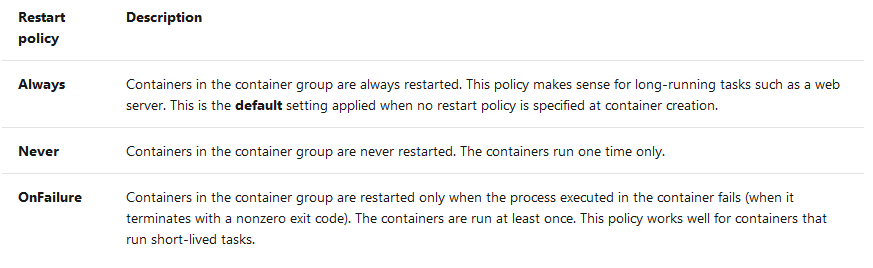
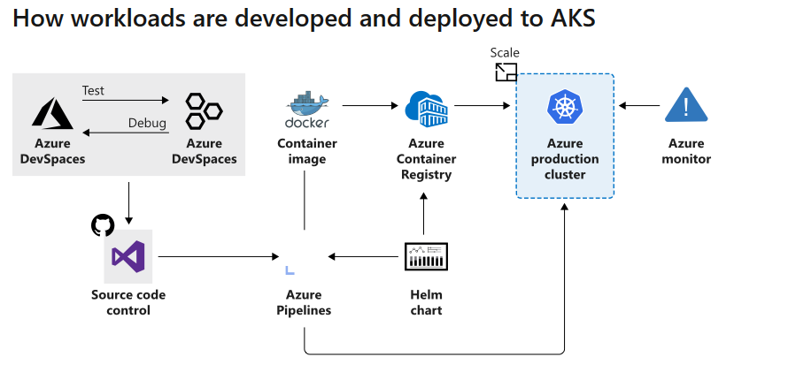
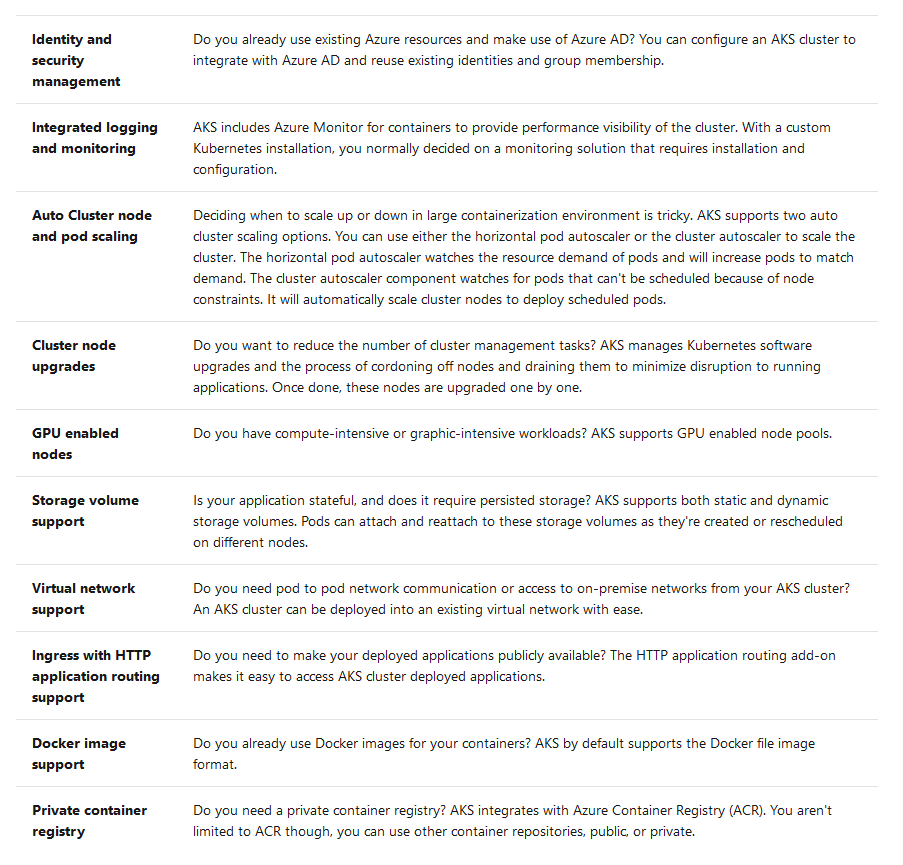
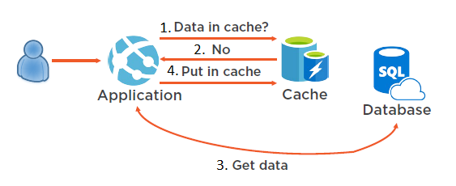
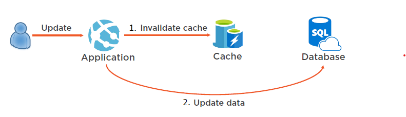

## container registry and container instanct
container registry is for creating self hosted docker images. 
This image host is not public but private. 

**registry authentication**
- Azure Active Directory identities. The identity could be assigned one of three roles:
  1. reader
  2. contributor
  3. owner

- admin account. It is disabled by default

### Replicate a container image to different Azure regions
Geo-replication enables an Azure container registry to function as a single registry, serving several regions with multi-master regional registries.


### container restart policy




### set connection string in environment
only in cmd you can set in a secure way.

### mount data volume

az container create \
  --resource-group learn-deploy-aci-rg \
  --name aci-demo-files \
  --image microsoft/aci-hellofiles \
  --location eastus \
  --ports 80 \
  --ip-address Public \
  --azure-file-volume-account-name $STORAGE_ACCOUNT_NAME \
  --azure-file-volume-account-key $STORAGE_KEY \
  --azure-file-volume-share-name aci-share-demo \
  --azure-file-volume-mount-path /aci/logs/

### userful cmd
```shell
# show container log
az container logs

#  provides diagnostic information during container startup. Once the container has started, it also writes standard output and standard error streams to your local terminal.
az container attach

# to run cmd in container
az container exec

```

## azure app service

azure app service is platform as a service(PaaS). 

### deployment slots
it maybe designed for ab test. E.g. you could create a production slot and a staging slot. Then you deploy the new code to staging and let 50% traffice goes to staging slot. In this way you could compare the result in production and staging. 

### cicd
Azure DevOps, 
GitHub, 
Bitbucket, FTP, or a local Git repository on your development machine.

**Automated deployment**


- Azure DevOps: You can push your code to Azure DevOps (previously known as Visual Studio Team Services), build your code in the cloud, run the tests, generate a release from the code, and finally, push your code to an Azure Web App.
- GitHub: Azure supports automated deployment directly from GitHub. When you connect your GitHub repository to Azure for automated deployment, any changes you push to your production branch on GitHub will be automatically deployed for you.
- Bitbucket: With its similarities to GitHub, you can configure an automated deployment with Bitbucket.
- OneDrive: Microsoft's cloud-based storage. You must have a Microsoft Account linked to a OneDrive account to deploy to Azure.
- Dropbox: Azure supports deployment from Dropbox, which is a popular cloud-based storage system that is similar to OneDrive.

**Manual deployment**

- Git: App Service web apps feature a Git URL that you can add as a remote repository. Pushing to the remote repository will deploy your app.
- az webapp up: webapp up is a feature of the az command-line interface that packages your app and deploys it. Unlike other deployment methods, az webapp up can create a new App Service web app for you if you haven't already created one.
- Zipdeploy: Use az webapp deployment source config-zip to send a ZIP of your application files to App Service. Zipdeploy can also be accessed via basic HTTP utilities such as curl.
- Visual Studio: Visual Studio features an App Service deployment wizard that can walk you through the deployment process.
- FTP/S: FTP or FTPS is a traditional way of pushing your code to many hosting environments, including App Service.


### Built-in auto scale support (automatic scale-out based on real-world load)


## web app in container

### Deploy a web app from a repository in Azure Container Registry

- The registry that contains the image. The registry can be Docker Hub, Azure Container Registry, or some other private registry.
- The image. This item is the name of the repository.
- The tag. This item indicates which version of the image to use from the repository. By convention, the most recent version is given the tag latest when it's built.
- Startup File. This item is the name of an executable file or a command to be run when the image is loaded. It's equivalent to the command that you can supply to Docker when running an image from the command line by using docker run. If you're deploying a ready-to-run, containerized app that already has the ENTRYPOINT and/or COMMAND values configured, you don't need to fill this in.

### cicd for web app in container in azure is done using webhook
Services and applications can subscribe to the webhook to receive notifications about updates to images in the registry. A web app that uses App Service can subscribe to an Azure Container Registry webhook to receive notifications about updates to the image that contains the web app. When the image is updated, and App Service receives a notification, your app automatically restarts the site and pulls the latest version of the image.

### Container Registry tasks 
You use the tasks feature of Container Registry to rebuild your image whenever its source code changes automatically. You configure a Container Registry task to monitor the GitHub repository that contains your code and trigger a build each time it changes. If the build finishes successfully, Container Registry can store the image in the repository. If your web app is set up for continuous integration in App Service, it receives a notification via the webhook and updates the app.

## azure kubernetes service(AKS)

### Why use a container?
- A container is immutable
- A container is lightweight
- Container startup is fast

### kubernetes(k8s)
**Kubernetes** is a portable, extensible open-source platform for automating deployment, scaling, and the management of containerized workloads.


- Kubernetes isn't a full PaaS offering. It operates at the container level and offers only a common set of PaaS features.

- Kubernetes isn't monolithic. It's not a single application that is installed. Aspects such as deployment, scaling, load balancing, logging, and monitoring are all optional. You're responsible for finding the best solution that fits your needs to address these aspects.
  
- Kubernetes doesn't limit the types of applications that can run. If your application can run in a container, it can run on Kubernetes. Your developers need to understand concepts such as microservices architecture, to make optimal use of container solutions.
  
- Kubernetes doesn't provide middleware, data-processing frameworks, databases, caches, nor cluster storage systems. All these items are run as containers or as part of another service offering.
  
- A Kubernetes deployment is configured as a cluster. A cluster consists of at least one master machine and one or more workers machines. For production deployments, the preferred master configuration is a multi-master high availability deployment with three to five replicated masters. These machines can be physical hardware or VMs. Theses worker machines are called nodes or agent nodes.

With all the benefits you receive with Kubernetes, keep in mind that you're responsible for maintaining your Kubernetes cluster. For example, you need to manage OS upgrades and the Kubernetes installation and upgrades. You also manage the hardware configuration of the host machines, such as networking, memory, and storage.

### Azure Kubernetes Service


- Microsoft manages kubernetes upgrading etc. 
- The master node in your cluster is free. You only pay for node VMs, storage and networking resources consumed in your cluster.
- default configuration for scaling, authentication, networking and monitoring.




**azure dev spaces**
- Azure Dev Spaces is supported only by AKS clusters in specific regions.
- allows developer to develop/test directly in aks


**Deployment Center**
With Azure DevOps Projects you can:

- Automatically create Azure resources, such as an AKS cluster
- Create an Azure Application Insights resource for monitoring an AKS cluster
- Enable Azure Monitor for containers to monitor performance for the container workloads on an AKS cluster

### When to use Azure Kubernetes Service
pod:a container packaged with app and image. 



## redis
- Azure Cache for Redis is an in-memory database.However, data persistance is also possible. You would need premium tier.

- Optimize your web applications by caching read-only data with Redis module that a Redis Cache is an in-memory data structure store that can be used as a database, cache or message broker.

- With Azure Cache for Redis, you could use transactions to ensure a message with a picture and text are sent together. Use data expiration to reset the name of the group chat after an hour. Finally, use eviction policies to make sure the oldest messages are being deleted first when you're running low on memory.

### Transactions in Azure Cache for Redis
Transactions in Redis work by queueing multiple commands to be executed as a group.
- Creating and running transactions
  - To begin a transaction block, enter the *MULTI* command. Further commands will be queued and not executed immediately. 
  - Running the EXEC command will execute all of the queued commands as a transactional unit.
  - running the DISCARD command will close the transaction block without running any of the queued commands.
  - Redis transactions do not support the concept of rollback.
  - Commands in a transaction that fail during execution (after EXEC is called) do not cause a transaction to be aborted or rolled back — Redis will still run all of the commands and consider the transaction to have completed successfully.
  - **ServiceStack.Redis** is a C# client library for interacting with Azure Cache for Redis.

### Data expiration in Redis
**data expiration**  is a feature that can automatically delete a key and value in the cache after a set amount of time.
you could use c#(servicestack.redis) or cmd to set data expiration.

## Eviction policies
An eviction policy is a plan that determines how your data should be managed when you exceed the maximum amount of memory available(out of memory).

**Types of eviction policies**


- noeviction: No eviction policy. Returns an error message if you attempt to insert data.
- allkeys-lru: Removes the least recently used key.
- allkeys-random: Removes a random key.
- volatile-lru: Removes the least recently used key out of all the keys with an expiration set.
- volatile-ttl: Removes the key with the shortest time to live based on the expiration set for it. 
  The key that would next expire will be deleted.
- volatile-random: Removes a random key that has an expiration set.

### How to set an eviction policy
-> advanced setting -> maxmemory-policy 


## Cache-aside pattern



The cache-aside pattern dictates that when you need to retrieve data from a data source, like a relational database, you should first check for the data in your cache. If the data is in your cache, use it. If the data is not in your cache, then query the database, and when you're returning the data back to the user, add it to your cache. This will then allow you to access the data from your cache the next time it's needed.


### When to implement the cache-aside pattern
to increase performance.

### points to consider for cache-aside pattern
- Lifetime: For cache-aside to be effective, make sure that the expiration policy matches the access frequency of the data. Making the expiration period too short can cause applications to continually retrieve data from the data store and add it to the cache.

- Evicting: Caches have a limited size compared to typical data stores, and they'll evict data if necessary. Make sure you choose an appropriate eviction policy for your data.

- Priming: To make the cache-aside pattern effective, many solutions will prepopulate the cache with data that they think will be accessed often.

- Consistency: Implementing the cache-aside pattern doesn't guarantee consistency between the data store and the cache. Data in a data store can be changed without notifying the cache. This can lead to serious synchronization issues.

- What happens if a command in a Redis transaction fails?
If a command is queued with incorrect syntax, the transaction will be automatically discarded if you try to execute it. If a command fails during execution, the transaction will complete as normal.All other cmd will be executed, either before or after the failing command.


