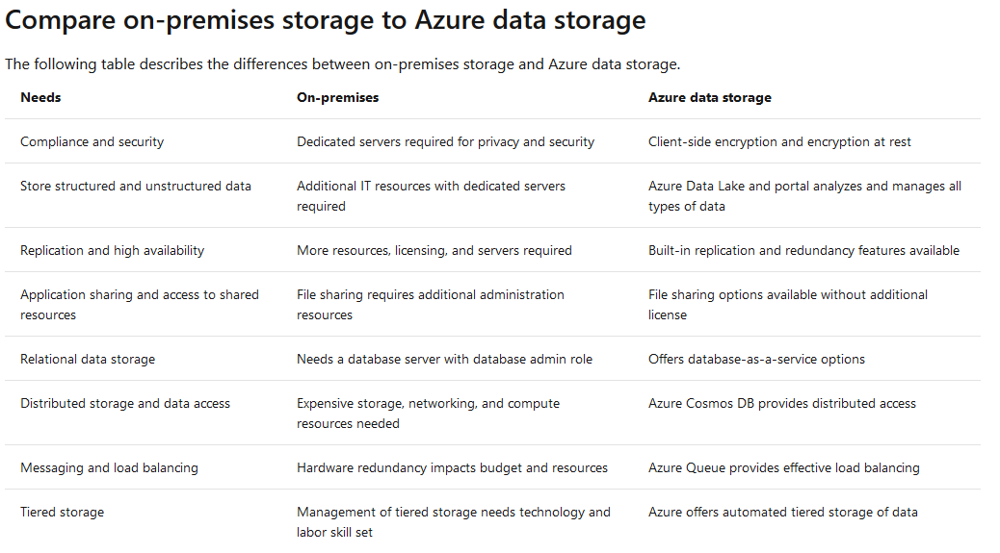
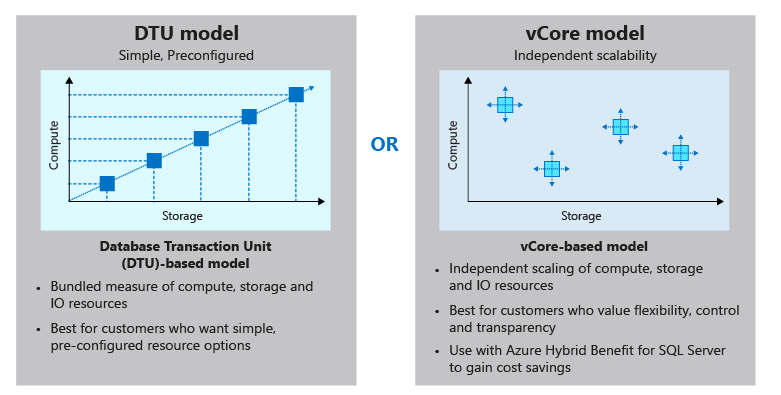
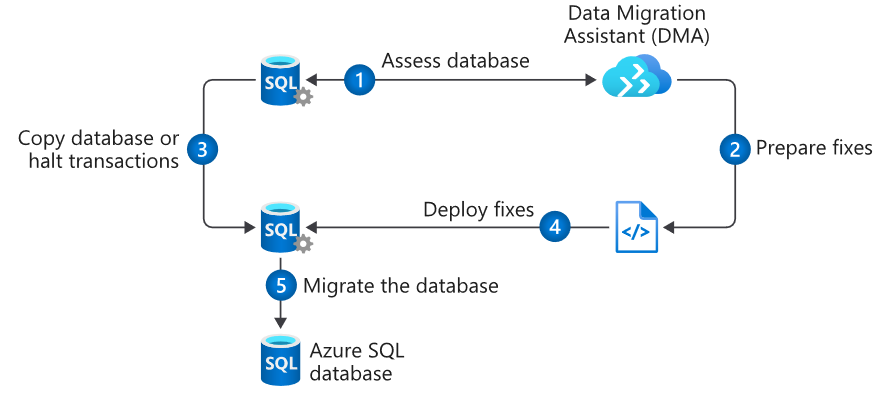
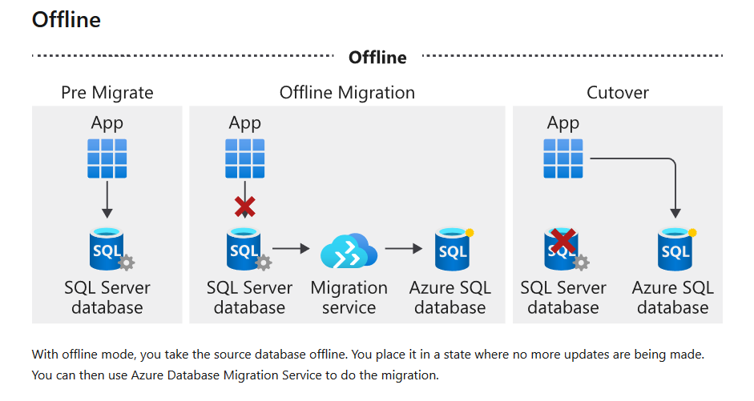
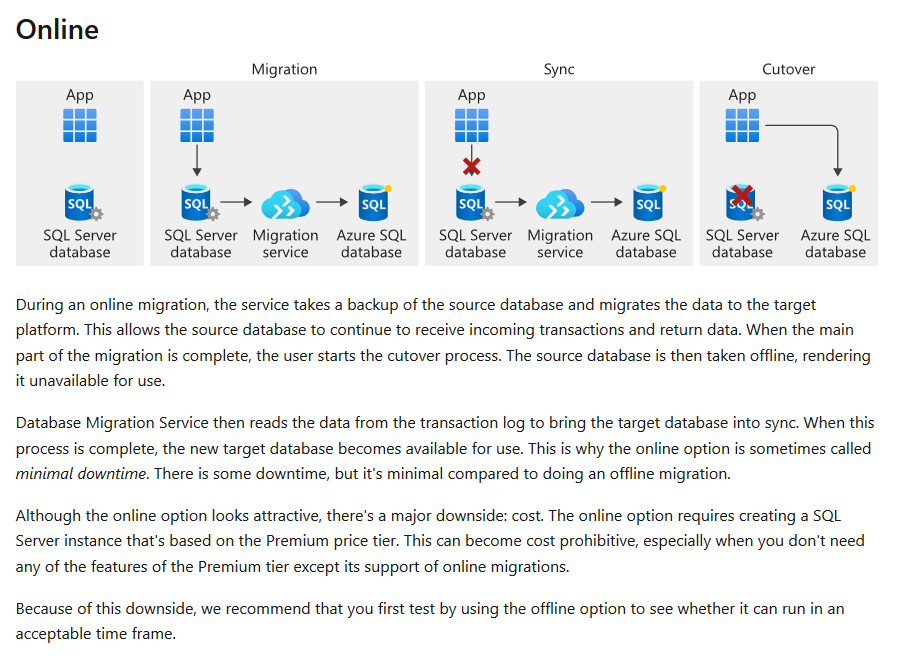
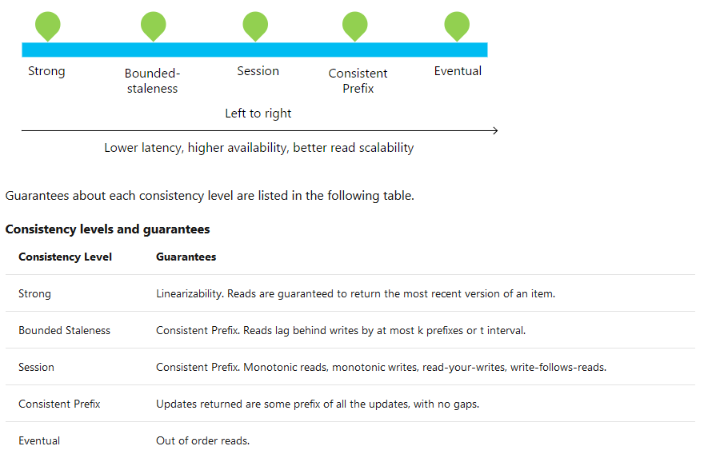
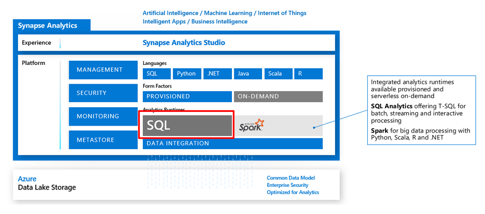
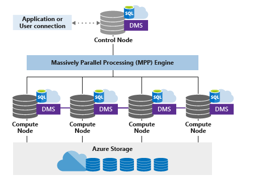
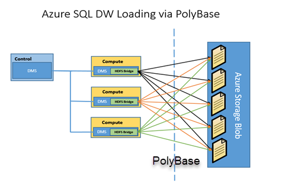

## Benefits of using Azure to store data
- automated backup and recovery
- replication across the globe
- support for data analytics
- encryption capabilities
- multiple data types
- data storage in virtual disks: up to 32TB
- storage tiers: like hot, cool storage tiers

### Types of data supported by azure data storage
- structured data. 
- semi-structured data. like nosql data
- unstructured data. like binary,video etc. 

### azure storage options  
- Azure sql database
- Azure cosmos db,globally distributed database service
- Azure blob. for unstructured data. streaming video possible.
- Azure Data Lake Storage. For big data. 
- Azure Files. Via SMB protocol.
- Azure Queue. Azure Queue storage is a service for storing large numbers of messages that can be accessed from anywhere in the world.
- Disk Storage. like virtual Disk. 
  
### storage features
- storage tiers
  1. hot storage
  2. cool storage
  3. archive storage

- encryption and replication
  1. azure storage service encryption(SSE) for data at rest. encryption and decryption from azure for data at rest.
  2. client-side encryption. encryption from client lib.
  3. replication possible.

### azure storage vs on-premise storage
- cost effectiveness
- reliability
- storage types
- agility

## Provision an Azure SQL database

- why azure sql database
  1. Convenience
  2. Cost
  3. Scale
  4. Security

### Choose performance: DTUs versus vCores
- dtu: database transaction unit. a combined meaure of compute,storage and io.
  1.  https://sqlperformance.com/2017/03/azure/what-the-heck-is-a-dtu
  2. dtu to IOPS(input output per second). https://stackoverflow.com/questions/24915593/translate-sql-azure-dtu-to-iops 
  3. good to read. about db metric https://docs.microsoft.com/en-gb/azure/sql-database/sql-database-service-tiers-dtu
  4. migrating from dtus to vcores needs long down time.
  5. Scaling: Single Azure SQL Database supports manual dynamic scalability, but not autoscale. For a more automatic experience, consider using elastic pools, which allow databases to share resources in a pool based on individual database needs. However, there are scripts that can help automate scalability for a single Azure SQL Database. For an example, see Use PowerShell to monitor and scale a single SQL Database.(https://docs.microsoft.com/en-us/azure/sql-database/scripts/sql-database-monitor-and-scale-database-powershell). You can change DTU service tiers or vCore characteristics at any time with minimal downtime to your application (generally averaging under four seconds).

- vcore: virtual core. in this model, you control the vcore, storage capacity and io throughput seperately. 

### sql elastic pools
sql elastic pools relate to eDTUs. They enable you to buy a set of compute and storage resources that are shared among all the databases in the pool. Each database can use the resources they need, within the limits you set, depending on current load.

### Azure SQL logical server
An administrative container for your databases, like setting firewall white list ip.

### What is collation
Collation refers to the rules that sort and compare data, like if case sensitivity, accent marks, and other language characteristics are important.
**SQL_Latin1_General_CP1_CI_AS** is the default collation. It means

- Latin1_General refers to the family of Western European languages.
- CP1 refers to code page 1252, a popular character encoding of the Latin alphabet.
- CI means that comparisons are case insensitive. For example, "HELLO" compares equally to "hello".
- AS means that comparisons are accent sensitive. For example, "résumé" doesn't compare equally to "resume".

## Azure sql elastic pool

### what is elastic pool
a group of Azure SQL databases. The pool allows the databases within the pool to share the allocated resources.

### When to use an elastic pool?
SQL elastic pools are ideal when you have several SQL databases that have a low average utilization, but have infrequent, high utilization spikes. 

### How many databases to add to a pool?
The general guidance is, if the combined resources you would need for individual databases to meet capacity spikes is more than 1.5 times the capacity required for the elastic pool, then the pool will be cost effective.
At a minimum, it is recommended to add at least two S3 databases or fifteen S0 databases to a single pool.
Depending on the performance tier, you can add up to **100 or 500 databases** to a single pool.

### create elastic pool
create sql server -> db -> elastic pool(link to sql server) -> add db to elastic pool

one sql server can have multiple elastic pool. one db can only in one elastic pool.

## Migrate your relational data stored in SQL Server to Azure SQL Database

### steps

1. Pre-migration(using DMA Datamigration Assistant, which is client side app from microsoft, to use it, you have to be dba of the server)
    - discovery.
    - assessment: check incompatibilities between azure sql server and on-premise sql server
    - convert: DMA generates the sql script for deploying db schema to azure sql server
  
2. Migration
   -  **schema**, this step can be done using Data Migration Assistant or manually via SQL Server Management Studio with the genreated script from the step 1.
   -  **data**, this step is done via Azure Database Migration Service. Database Migration Service can be run in two modes, **online and offline**(online requests Premium tier, cost more, best practice: try offline first). When it's running in online mode, there are two additional steps. The first is **sync**, in which any changes made to the data in the source system after the migration are brought into the target database. The other is **cutover**, in which the source database is taken offline and the new Azure SQL database becomes available.
   
   

3. Post-migration
   - Validation testing 
   - performance tests

The post-migration phase is critical because it ensures that your data is both accurate and complete. In addition, it alerts you to any performance issues that might arise with the workload in the new environment.

## Develop and configure an ASP.NET application that queries an Azure SQL database

use public endpoint of the db to connect.

## create cosmos db 

### What is a request unit?
It is a measure of the db operation. Reading 1kb document is 1ru, while create, delete or replace cost more ru.

**Request Unit(Ru) depending on **
- Item size
- Item indexing
- Item property count
- Indexed properties
- Data consistency
- Query patterns 
  - The number of query results
  - The number of predicates
  - The nature of the predicates
  - The number of user-defined functions
  - The size of the source data
  - The size of the result set
  - Projections

The ru costed by operation could be found via Evaluate request unit charge for a query.(https://docs.microsoft.com/en-us/azure/cosmos-db/optimize-cost-queries#evaluate-request-unit-charge-for-a-query)

**Exceeding throughput limits**
Your request will be rate-limited, when exceeding the new throughput. Baisically, the retry after spedified interval should be done. .net sdk can do it automatically.

You can change the number of request units provisioned to a database at any time. When you create an account, you can provision a minimum of 400 RU/s, or a maximum of 250,000 RU/s in the portal. If you need even more throughput, fill out a ticket in the Azure portal.

### partition 

scale out or horizontal scaling is possible for cosmos db.

**partition key.**

A partition key is the value by which Azure organizes your data into logical divisions. It should aim to evenly distribute operations across the database to avoid hot partitions. it's set when you create a container and can't be changed. The amount of required RU's and storage determines the number of required physical partitions for the container, which are completely managed by Azure Cosmos DB. When additional physical partitions are needed, Cosmos DB automatically creates them by splitting existing ones. There is no downtime or performance impact for the application. The storage space for the data associated with each partition key can't exceed 20 GB, which is the size of one physical partition in Azure Cosmos DB. So, if your single userID or productId record is going to be larger than 20 GB, think about using a composite key instead so that each record is smaller. An example of a composite key would be userID-date, which would look like CustomerName-08072018. This composite key approach would enable you to create a new partition for each day a user visited the site.

**Choosing a Partition Key**
For each Azure Cosmos DB container, you should specify a partition key that satisfies the following core properties:

- Have a high cardinality. This option allows data to distribute evenly across all physical partitions.
- Evenly distribute requests. Remember the total number of RU/s is evenly divided across all physical partitions.
- Evenly distribute storage. **Each partition can grow up to 20 GB in size**.

## Distribute your data globally with Azure Cosmos DB

**why Global distribution**

- Delivering low-latency data access to end users no matter where they are located around the globe
- Adding regional resiliency for business continuity and disaster recovery (BCDR).(paired azure region:https://docs.microsoft.com/en-us/azure/best-practices-availability-paired-regions)

**Cost**  
Replicating to 3 additional regions, would cost approximately four times the original non-replicated database.

**set replicate data**
setting -> replicate data globally

### Write to multiple regions

**multi-master support**

Multi-master support is an option that can be enabled on new Azure Cosmos DB accounts. Once the account is replicated in multiple regions, each region is a master region that equally participates in a write-anywhere model, also known as an active-active pattern.

**benefits of multi-master support are:**

 
- Single-digit write latency – Multi-master accounts have an improved write latency of <10 ms for 99% of  writes, up from <15 ms for non-multi-master accounts.

- 99.999% read-write availability - The write availability multi-master accounts increases to 99.999%, up from the 99.99% for non-multi-master accounts.

- Unlimited write scalability and throughput – With multi-master accounts, you can write to every region, providing unlimited write scalability and throughput to support billions of devices.

- Built-in conflict resolution – Multi-master accounts have three methods for resolving conflicts to ensure global data integrity and consistency.

**Conflict resolution offered by Azure Cosmos DB:**

- Last-Writer-Wins (LWW), in which conflicts are resolved based on the value of a user-defined integer property in the document. By default _ts is used to determine the last written document. Last-Writer-Wins is the default conflict handling mechanism.
- Custom - User-defined function, in which you can fully control conflict resolution by registering a User-defined function to the collection. A User-defined function is a special type of stored procedure with a specific signature. If the User-defined function fails or does not exist, Azure Cosmos DB will add all conflicts into the read-only conflicts feed they can be processed asynchronously.
- Custom - Async, in which Azure Cosmos DB excludes all conflicts from being committed and registers them in the read-only conflicts feed for deferred resolution by the user’s application. The application can perform conflict resolution asynchronously and use any logic or refer to any external source, application, or service to resolve the conflict.

**cosmos sdk failover**
- read region has an outage. 
  
  sdk detects read region unavailable. -> mark this region offline -> find available read region -> if no available region found -> redirect to write region -> if failed region ok then sdk resume the original setting. 

- write region has an outage

  sdk detects write region unavailable. -> mark this region offline -> find available write region ( Applications can use the WriteEndpoint property of DocumentClient class to detect the change in write region. not automatically??) -> if failed region ok then sdk resume the original setting. 

  **Consistency basics of azure cosmos db**

  

  About 73% of Azure Cosmos DB tenants use session consistency and 20% prefer bounded staleness.

  - strong. Low latency not possible. write must be processed by all replica first. 
  - bounded staleness. can be late of several version or some interval.
  - session. I can see my write. 
  - consistent prefix. read reveals the correct write order.  e.g. write order is a,b,c. read can never be b,a,c. 
  - eventual. In the end, they converges. 

## Insert and query data in your Azure Cosmos DB database

### sql join clause
The JOIN clause lets you perform inner joins with the document and the document subroots. meaning the document subroots not null.

### Geospatial queries
there are Geospatial queries feature in sql api from azure cosmos db. like getting distance. 

### select is the only required clause: select 1 returns 1

## Design a data warehouse with Azure Synapse Analytics
Azure Synapse Analytics combines the enterprise data warehouse of SQL, the Big Data analytics capabilities of Spark, and data integration technologies to ease the movement of data between both, and from external data sources. 

### Data Warehousing with Azure Synapse Analytics

- sql pool:CPU, memory, and IO are bundled into units of compute scale.
- Data Warehousing Units: size of SQL pool is determined by Data Warehousing Units (DWU)
- more dwu cost more

### why synapse

The Azure Synapse Analytics capabilities are made possible due to the decoupling of computation and storage using the Massively Parallel Processing architecture.

### Azure Synapse Analytics features
- Workload Management
  - workload groups
  - workload classification
  - workload priority
- Result-set Cache
- Materialized Views
- CI/CD Support

### workloads
- Modern Data Warehouse worklods
  data sources can be many and different types. 

- Advanced Analytical Workloads
  big data store, hadoop, spark. PolyBase  could be used to query big data store

### massively parallel processing concepts

### Synapse table type in storage 
- Hash:good
- Round Robin: easy, one by one
- Replicate: good for small table, basically a copy of data 

## PolyBase in synapse analytics

### data loading steps

- Extract the source data into text files.
- Load the data into Azure Blob storage, Hadoop, or Azure Data Lake Store.
- Import the data into SQL Data Warehouse staging tables by using PolyBase.
  - create external data source credential table
  - create external data source connection
  - define the import file format
  - Create a temporary table
  - Create a destination table
- Transform the data (optional).
- Insert the data into production tables.

