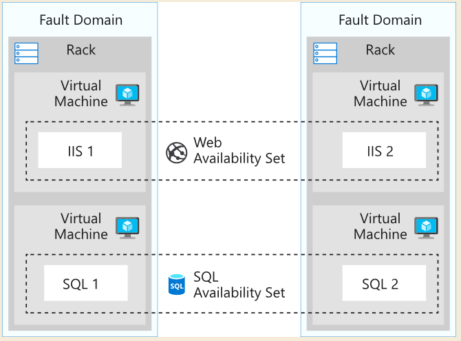
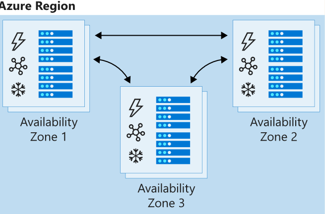
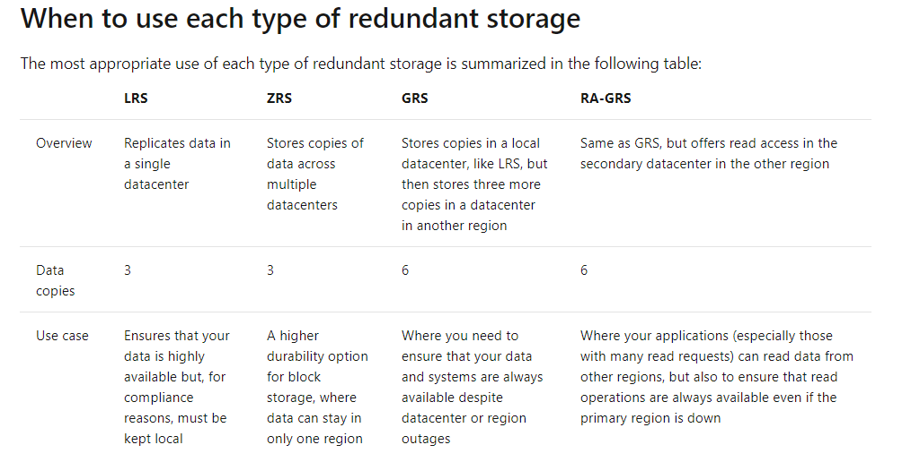

## OSI model Layer architecture

- Layer 1: Physical Layer
- Layer 2: Data Link Layer
- Layer 3: Network Layer
- Layer 4: Transport Layer
- Layer 5: Session Layer
- Layer 6: Presentation Layer
- Layer 7: Application Layer


## Availability sets, Fault domain and Rack

- **availability set**: a logical grouping that you use to isolate virtual machine resources from each other when they're deployed.
  1. one availability set can have up to  three fault domains.
  2. one availability set can have five logical update domains which then can be increased to a maximum of 20

- **Fault domain**: some racks of servers which share the infrastructure, like power and network. 
- **Rack**: unit for some servers
  



## Availability zones and update domain

- An Availability Zone: in an Azure region is a combination of a fault domain and an update domain.The virtual machines in an availability zone are placed in different physical locations within the same region.

- update domain: the logical group that updates take place. 





## Data redundancy in azure

- Locally redundant storage (LRS, hardware fails)
  
  Locally redundant storage replicates data and stores three copies across fault domains, or racks of hardware, within a single datacenter facility in one region. Data is replicated so that if there's a hardware fault or maintenance work, your data is still available and accessible.

- Zone-redundant storage (ZRS,store in different dc but in same region,99.999999999999 durability of data)
  
  Zone-redundant storage replicates your data across three storage clusters in a region. Each cluster is physically separated from the other two, which means that each cluster is supplied by separate utilities, such as power or networking.

- Geographically redundant storage (GRS, store in dc across region)
  
  Geographically redundant, or geo-redundant, storage provides multiple levels of replication. Your data is replicated three times within the primary region, and then this set is replicated to a secondary region.

- Read-access geo-redundant storage (RA-GRS)

    After the failover and DNS endpoint updates are complete, the storage account is set back to LRS. You're responsible for reverting the replication settings from LRS to RA-GRS or GRS after the primary region becomes available again.



## restriction on subscription
Your subscription tier enforces limits on how many resources you can create, as well as the total size of those resources. For example, you are capped to 20 virtual CPUs with the pay-as-you-go subscription, and only 4 vCPUs for a free tier. The Azure CLI will let you know when you exceed this with a Quota Exceeded error. If you hit this error in your own paid subscription, you can request to raise the limits associated with your paid subscription (up to 10,000 vCPUs!) through a free online request.
https://docs.microsoft.com/en-gb/azure/azure-resource-manager/management/azure-subscription-service-limits

https://docs.microsoft.com/en-gb/azure/azure-resource-manager/templates/error-resource-quota

## arm template
### what is in arm template
- Parameters
- Variables
- Functions
- Resources
- Outputs
- quick start template: https://azure.microsoft.com/en-us/resources/templates/
- azure resource manager visualizer: http://armviz.io/designer
- arm template refference: https://docs.microsoft.com/en-gb/azure/templates/

## useful azure cli cmd
```bash
#set default working resource group
az configure --defaults group=learn-189a9d0f-b5e4-4485-a130-06f458c3a600


##validate arm file
az deployment group validate \
  --resource-group $RESOURCEGROUP \
  --template-uri "https://raw.githubusercontent.com/Azure/azure-quickstart-templates/master/101-vm-simple-windows/azuredeploy.json" \
  --parameters adminUsername=$USERNAME \
  --parameters adminPassword=$PASSWORD \
  --parameters dnsLabelPrefix=$DNS_LABEL_PREFIX

## run extensions at vm
az vm extension set \
  --resource-group $RESOURCEGROUP \
  --vm-name SimpleWinVM \
  --name CustomScriptExtension \
  --publisher Microsoft.Compute \
  --version 1.9 \
  --settings '{"fileUris":["https://raw.githubusercontent.com/MicrosoftDocs/mslearn-welcome-to-azure/master/configure-iis.ps1"]}' \
  --protected-settings '{"commandToExecute": "powershell -ExecutionPolicy Unrestricted -File configure-iis.ps1"}'

#create vm
az vm create \
  --resource-group testVmRg \
  --location westus \
  --name SampleVM \
  --image UbuntuLTS \
  --admin-username azureuser \
  --generate-ssh-keys \
  --verbose
  

## list vm image
az vm image list --output table
az vm image list --sku Wordpress --output table --all
az vm image list --publisher Microsoft --output table --all
az vm image list --location eastus --output table

## list possible resize options of a vm
az vm create \
    --resource-group learn-ebc3a986-7567-4441-97b8-f5d4e4301357 \
    --name SampleVM2 \
    --image UbuntuLTS \
    --admin-username azureuser \
    --generate-ssh-keys \
    --verbose \
    --size "Standard_DS5_v2"

##resize image
az vm list-vm-resize-options \
    --resource-group learn-ebc3a986-7567-4441-97b8-f5d4e4301357 \
    --name SampleVM \
    --output table
	
## list vm ip
az vm list-ip-addresses -n SampleVM -o table

#
clear

## --query to get result
az vm show \
    --resource-group learn-ebc3a986-7567-4441-97b8-f5d4e4301357 \
    --name SampleVM \
    --query "provisioningState"
	
## --no-wait to make azure cli to imediately move on to the next command


```