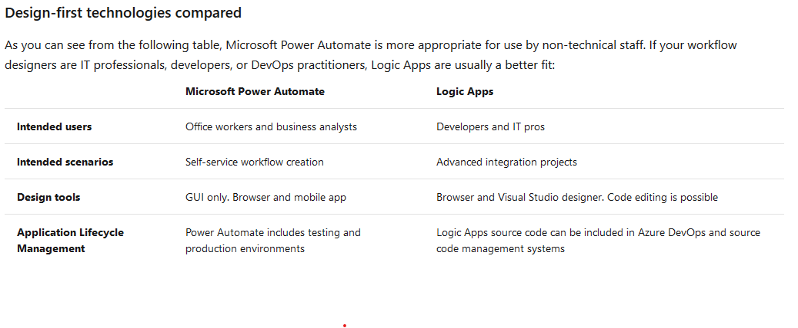
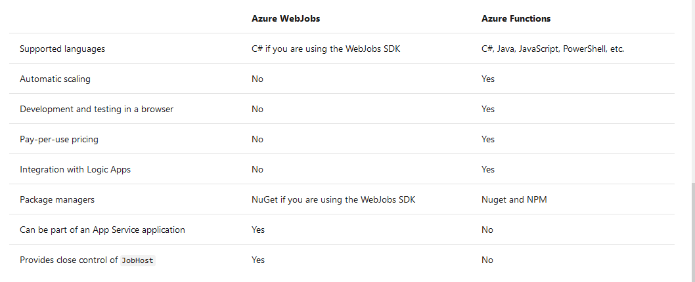
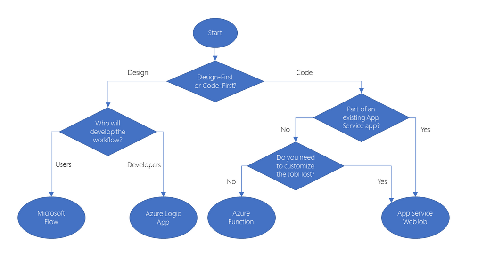

# automate business process/workflow

## workflow
Business processes modeled in software are often called workflows.

## workflow options from azure

Azure includes four different technologies that you can use to build and implement workflows that integrate multiple systems:

- Logic Apps
- Microsoft Power Automate(flow)
- WebJobs
- Azure Functions

## Design-first technologies

it has gui to help define the workflow.

- Logic Apps
- Microsoft Power Automate. 
  
  There are four different types of flow that you can create:

    - Automated: A flow that is started by a trigger from some event. For example, the event could be the arrival of a new tweet or a new   file being uploaded.
    - Button: Use a button flow to run a repetitive task with a single click from your mobile device.
    - Scheduled: A flow that executes on a regular basis such as once a week, on a specific date, or after 10 hours.
    - Business process: A flow that models a business process such as the stock ordering process or the complaints procedure.

## Code-first technologies
- webjobs. it is a part of the Azure App Service that you can use to run a program or script automatically. 
  1. Continuous
  2. Triggered
  3. The WebJobs SDK only supports C# and the NuGet package manager.
- azure functions

**webjobs vs azure functions**

In most cases, the simple administration and more flexible coding model provided by Azure Functions may lead you to choose them in preference to WebJobs. However, you may choose WebJobs for the following reasons:

You want the code to be a part of an existing App Service application and to be managed as part of that application, for example in the same Azure DevOps environment.
You need close control over the object that listens for events that trigger the code. This object in question is the JobHost class, and you have more flexibility to modify its behavior in WebJobs.

## how to choose a service
