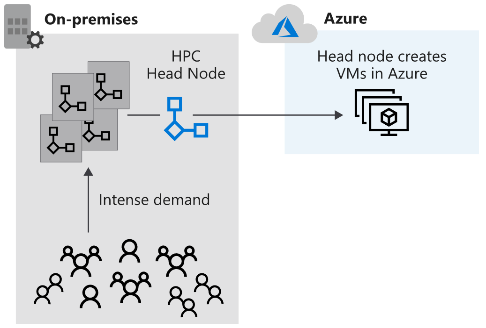
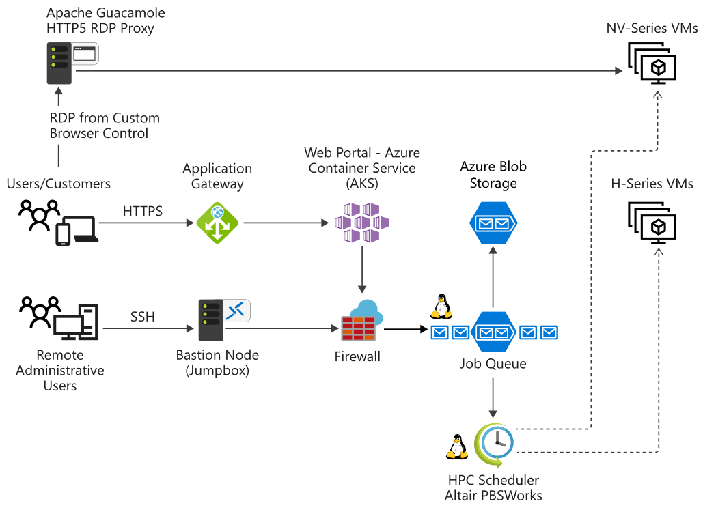

# hpc

## what is hpc(high performance computing)
 HPC system needs many powerful CPUs and, for graphics-intensive tasks, GPUs. They also require fast disks and high-speed memory.

 ## Azure Batch
 - Azure Batch is a fully managed service for HPC tasks in Azure.
 - Azure Batch is a service for working with large-scale parallel and computationally intensive tasks on Azure. Batch is ideally suited to heavy workloads, such as financial risk modeling, 3D rendering, media transcoding, and genetic sequence analysis. 
 - When you create Batch tasks, the scheduling and management engine determines the optimal plan for allocating and scheduling tasks across the specified compute capacity. This plan happens during the initial creation of a Batch pool. Batch handles provisioning of the compute capacity and optimizes the way the work is done in parallel. You only pay for the underlying compute, networking, and storage you use. The Batch scheduling and management service is free.
 - Batch also lets you use some of the most important 3D rendering packages, like Maya, 3D Studio Max, and Chaos V-Ray.

 

## Azure VM HPC instances

### H-series VMs
Azure H-series VMs are a family of the most powerful and fastest CPU-based VMs on Azure. These VMs are optimized for applications that require high CPU frequencies or large amounts of memory per core

#### HB-series VMs
HB-series VMs specifically target applications requiring extreme memory bandwidth, particularly fluid dynamics, explicit finite element analysis, and weather modeling.
Supported by all subscription but not azure region.

#### HC-series VMs
HC-series VMs are optimized for applications driven by dense computation.

## Remote Direct Memory Access(RDMA)

Message Passing Interface (MPI) is a protocol for communication between computers as they run complex HPC tasks in parallel. 

## InfiniBand interconnects
InfiniBand is a data interconnect hardware standard for HPC. It's often used to accelerate communications between components, both within a single server and between servers. 

### N-series VMs
Both compute-intensive and graphics-intensive VMs.(with nvidia gpus)

#### NC-series VMs
This series is the lowest cost of the N-series tiers.

#### ND-series VMs
ND-series VMs are optimized for AI and deep learning workloads. 

## What is HPC Pack?
- HPC Pack offers a series of installers for Windows that allows you to configure your own control and management plane, and **highly flexible deployments** of on-premises and cloud nodes.(mix of on-premise and cloud).
- SQL Server and an Active Directory controller needed
- Windows Server 2012 R2 or later for head node

## Common HPC use cases
- Finite element analysis
- 3D model rendering
- DNA analysis
- Computer-aided design
  
- Computational fluid dynamics