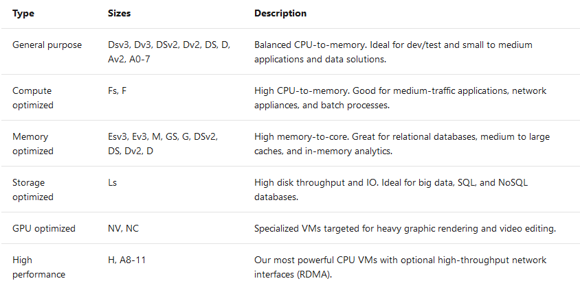
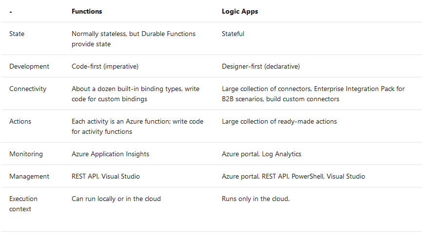

# compute:VM

## azure compute services
- virtual machines
- containers
- azure app service (paas)
- serverless computing

## virtual machine

### Scaling VMs in Azure
- Availability sets (see in basc concept)
- Scale sets. 
  
  1. Azure Virtual Machine Scale Sets let you create and manage a group of identical, load balanced VMs.
  2. Virtual machine scale sets support both Linux and Windows VMs in Azure. However, keep in mind that you're limited to running 1,000 VMs on a single scale set.
  3. Scaling options:
     - horizontal scaling: Horizontal scaling is the process of adding or removing several VMs in a scale set.
     - vertical scaling: is the process of adding resources such as memory, CPU power, or disk space to VMs.Vertical scaling typically requires rebooting the affected VMs in the scale set. This process can lead to temporary degraded performance across the scale set while the VMs restart.
  4. scaling types:
     - Scheduled scaling
     - Autoscaling:  metric-based threshold scaling. for unpredictable loads.
  5. low-priority scale sets: no sla, if azure needs vm back, you get a removal notice.Either delete or deallocate. 
   
- azure batch. needed when you need super power. 

### pre-defined vm


### vm and software in vm deployment method
- Custom scripts extension (post-deployment)    
    1. Ease of setup. The custom script extension is built into the Azure portal, so setup is easy.
    2. Management. The management of custom scripts can get tricky as your infrastructure grows and you accumulate different custom scripts for different resources.
    3. Interoperability. The custom script extension can be added into an Azure Resource 4. 4. Manager template. You can also deploy it through Azure PowerShell or the Azure CLI.
    4. Configuration language. You can write scripts by using many types of commands. You can use PowerShell and Bash.
    5. **Limitations and drawbacks**. Custom scripts aren't suitable if your script needs more than one and a half hours to apply your configuration. Avoid using custom scripts for any configuration that needs reboots. The custom script extension is good for small configurations after provisioning. It's also good if you need to add or update some applications on a target machine quickly. It's imperative for ad-hoc cross-platform scripting.

- Desired State Configuration extensions (DSC)
    1. Ease of setup. Desired State Configurations (DSCs) are easy to read, update, and store. Configurations define what state you want to achieve. The author doesn't need to know how that state is reached.
    2. Management. DSC democratizes configuration management across servers.
    3. Interoperability. DSCs are used with Azure Automation State Configuration. They can be configured through the Azure portal, Azure PowerShell, or Azure Resource Manager templates.
    4. Configuration language. Use PowerShell to configure DSC.
    5. Limitations and drawbacks. You can only use PowerShell to define configurations. If you use DSC without Azure Automation State Configuration, you have to take care of your own orchestration and management.

- Chef (third party)
  
    1. Ease of setup. The Chef server runs on the master machine, and Chef clients run as agents on each of your client machines. You can also use hosted Chef and get started much faster, instead of running your own server.
    2. Management. The management of Chef can be difficult because it uses a Ruby-based domain-specific language. You might need a Ruby developer to manage the configuration.
    3. Interoperability. Chef server only works under Linux and Unix, but the Chef client can run on Windows.
    4. Configuration language. Chef uses a Ruby-based domain-specific language.
    5. Limitations and drawbacks. The language can take time to learn, especially for developers who aren't familiar with Ruby.

- Terraform (third party)
  
    1. Ease of setup. To get started with Terraform, download the version that corresponds with your operating system and install it.
    2. Management. Terraform's configuration files are designed to be easy to manage.
    3. Interoperability. Terraform supports Azure, Amazon Web Services, and Google Cloud Platform.
    4. Configuration language. Terraform uses Hashicorp Configuration Language (HCL). You can also use JSON.
    5. Limitations and drawbacks. Because Terraform is managed separately from Azure, you might find that you can't provision some types of services or resources.

- Azure automation state configuration (control DSC configurations in azure and on-premise)
  
    1. Ease of setup. Automation State Configuration isn't difficult to set up, but it requires the user to be familiar with the Azure portal.
    2. Management. The service manages all of the virtual machines for you automatically. Each virtual machine can send you detailed reports about its state, which you can use to draw insights from this data. Automation State Configuration also helps you to manage your DSC configurations more easily.
    3. Interoperability. Automation State Configuration requires DSC configurations. It works with your Azure virtual machines automatically, and any virtual machines that you have on-premises or on another cloud provider.
    4. Configuration language. Use PowerShell.
    5. Limitations and drawbacks. You can only use PowerShell to define configurations.

- Azure Resource Manager templates (ARM template)
    1. Ease of setup. You can create Resource Manager templates easily. You have many templates available from the GitHub community, which you can use or build upon. Alternatively, you can create your own templates from the Azure portal.
    2. Management. Managing Resource Manager templates is straightforward because you manage JavaScript Object Notation (JSON) files.
    3. Interoperability. You can use other tools to provision Resource Manager templates, such as the Azure CLI, the Azure portal, PowerShell, and Terraform.
    4. Configuration language. Use JSON.
    5. Limitations and drawbacks. JSON has a strict syntax and grammar, and mistakes can easily render a template invalid. The requirement to know all of the resource providers in Azure and their options can be onerous.
    6. benefits 
        - Templates improve consistency
        - Templates help express complex deployments
        - Templates reduce manual, error-prone tasks
        - Templates are code
        - Templates promote reuse
        - Templates are linkable
- cloud-init

  
### create vm from customized image

1. generalized image (hardware independent, no username, log etc. but with software/plugin)
   - create wanted vm
   - generalize server (windows via Sysprep.(oobe), linux via waagent)
   - capture vm in azure portal vm menu to get image
   - open image in azure portal, create vm from the image

2. specialized image(keep the login,hardware setting,log)
   - create wanted vm 
   - create the snapshot of the vm disk(open vm disk in azure portal)
   - create managed disk from snapshot 
   - in azure portal open the newly created disk, and create vm from this disk
  


**steps(concept below)**
1. create customized image
  - generalized image(without machine name etc): windows via Sysprep.(oobe), linux via waagent. 
  ```bash
  #windows via Sysprep
  #linux
  waagent -deprovision+user
  ```
  - specialized image (with machine name etc):use portal to capture image or snapshot a image. 
   
2. create vm based on customized image


**VHD (virtual hard disk)**

VHD could be used as os disk or data disk.

benefits of using VHD:
- High availability. (managed disks in multiple datacenter)
- physical serurity. (vhd could be encrypted)
- Durability (no media failure)
- Scalability (create many vm from same vhd)
- Cost and performance

What is a virtual machine image?
pre-setup vm image.

**what is generalized image?**

custom virtual machine image with no specific config. 

steps to create generalized image.
1. create a vm
2. generalization(cleaning up tasks are needed):
    - The host name of your virtual machine.
    - The username and credentials that you provided when you installed the operating system on the virtual machine.
    - Log files.
    - Security identifiers for various operating system services.
    - For Windows, use the Microsoft System Preparation (Sysprep) tool. 
    - For Linux, use the Windows Azure Linux Agent (waagent) tool.


You can create a managed image resource from a generalized virtual machine that's stored as either a managed disk or an unmanaged disk in a storage account. The image can then be used to create multiple virtual machines.

**What is a specialized virtual image?**

customized vhd with softwares and software config etc. 

**Storage of disk images**
managed disk or unmanaged disks

## containers in azure (docker)

- Azure Container Instances (ACI)
- Azure Kubernetes Service (AKS)
  
- Open Service Broker for Azure (OSBA)


## azure app service

- Web Apps
- API Apps
- WebJobs (scheduler job)
- Mobile Apps (backend,Send push notifications)

## serverless computing

benefits:
- no infr work
- scalability
- only pay for what u use


Azure has two implementations of serverless compute:

- **Azure Functions**, which can execute code in almost any modern language.Azure Functions scale automatically based on demand.
  event trigger:
  1. REST request, 
  2. timer, or 
  3. message from another Azure service
  4. stateless(by default), statefull(called "Durable Functions")
   
- **Azure Logic Apps**, which are designed in a web-based designer and can execute logic triggered by Azure services without writing any code.

### functions vs logic apps
