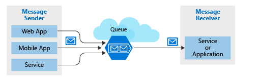
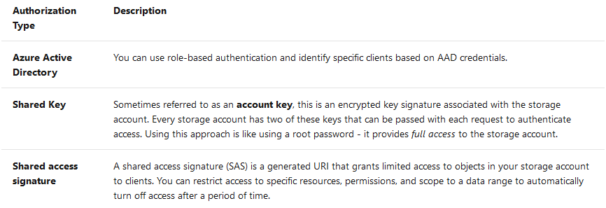
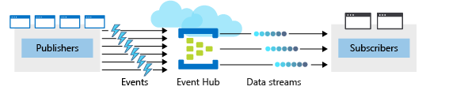
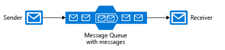
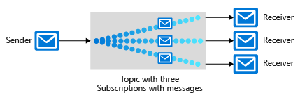
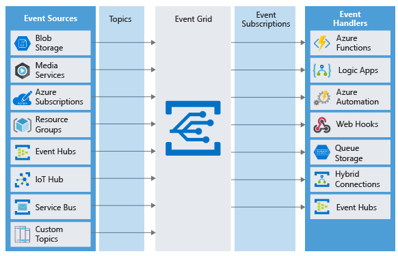
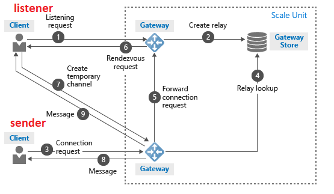

# messageBrokeringAndServerlessApp
## azure functions
### serverless compute
- no infrastructure services. 
- scaling on load automatically
- azure function and azure logic app could be used
- pros:
    - Avoids over-allocation of infrastructure
    - Stateless logic
    - Event driven
    - Functions can be used in traditional compute environments
- cons:
    - Execution time.  Timeout is configurable to a maximum of 10 minutes. HTTP response, the timeout is further restricted to 2.5 minutes. Finally, there's also an option called **Durable Functions** that allows you to orchestrate the executions of multiple functions without any timeout.
    - Execution frequency. For frequently used function, it will cost more than hosing a vm.

### function app
- service plan
    - Consumption service plan. Timeout limitation. pay as used. 
    - Azure App Service plan. Just app service plan. no timeout limitation. 
- storage account needed.
- triggers
    - Blob storage: Start a function when a new or updated blob is detected.
    - Azure Cosmos DB: Start a function when inserts and updates are detected.
    - Event Grid: Start a function when an event is received from Event Grid.
    - HTTP: Start a function with an HTTP request.
    - Microsoft Graph Events: Start a function in response to an incoming webhook from the Microsoft Graph. Each instance of this trigger can react to one Microsoft Graph resource type.
    - Queue storage: Start a function when a new item is received on a queue. The queue message is provided as input to the function.
    - Service Bus: Start a function in response to messages from a Service Bus queue.
    - Timer: Start a function on a schedule.
- binding. The entity that funktion get input and output. Trigger is a kind of binding. There are a lot of different bindings.(https://docs.microsoft.com/en-gb/azure/azure-functions/functions-triggers-bindings#supported-bindings)
- function auth: using the header x-functions-key. 

## logic apps
- Trigger types: data, time, and manual.
  - polling trigger: cron job that keeps checking if new data comes
  - push trigger: like web hook. 
  - trigger parameters and return values based on connector

## messaging model in azure 

### concept: message and event
- mesage
  
  - A message contains raw data, produced by one component, that will be consumed by another component.
  - A message contains the data itself, not just a reference to that data.
  - The sending component expects the message content to be processed in a certain way by the destination component. The integrity of the overall system may depend on both sender and receiver doing a specific job.

- event
    
  - An event is a lightweight notification that indicates that something happened.
  - The event may be sent to multiple receivers, or to none at all.
  - Events are often intended to "fan out," or have a large number of subscribers for each publisher.
  - The publisher of the event has no expectation about the action a receiving component takes.
  - Some events are discrete units and unrelated to other events.
  - Some events are part of a related and ordered series.

- how to choose messages or events 
    - Does the sending component expect the communication to be processed in a particular way by the destination component? If the answer is yes, choose to use a message. If the answer is no, you may be able to use events.

### possible tools from azure
- azure queue storage(messages)
- azure service bus(messages)
- Azure Service Bus Topics(messages/event):a queue can be suscribed by multiple components.
- azure event grid
- azure event hub

### Benefits of queues
- Increased reliability
- Message delivery guarantees
  - At-Least-Once Delivery.(Sometime, if there are two nodes, one node takes too long to process the request,the queue can send the request to another node to process.)
  - At-Most-Once Delivery
  - First-In-First-Out (FIFO)
- Transactional support: a serie of actions can be either done or not at all. 

### how to choose service bus and queue storage. 

**Choose Service Bus Topics if**

- you need multiple receivers to handle each message

**Choose Service Bus queues if:**

- You need an At-Most-Once delivery guarantee.
- You need a FIFO guarantee.
- You need to group messages into transactions.
- You want to receive messages without polling the queue.
- You need to provide a role-based access model to the queues.
- You need to handle messages larger than 64 KB but less than 256 KB or 1M (premium tier).
- Your queue size will not grow larger than 80 GB.
- You would like to be able to publish and consume batches of messages.

**Choose Queue storage if:**

- You need an audit trail of all messages that pass through the queue.
- You expect the queue to exceed 80 GB in size.
- You want to track progress for processing a message inside of the queue.

### what is Azure Event Grid

one-event-at-a-time delivery.

### Azure Event Hubs

Event Hubs is an intermediary for the publish-subscribe communication pattern. Unlike Event Grid, however, it is optimized for extremely high throughput, a large number of publishers, security, and resiliency.

Decouple the event publisher and event consumer. real time and batch processing
- Partitions. It is in fact that event hubs saves event into cache(persistent). A event hubs has at least 2 partitions. default is 4.
- Capture. Save data somewhere.
- Authentication. Event Hubs has support for pipelining event streams to other Azure services

**Choose Event Hubs if:**

- You need to support authenticating a large number of publishers.
- You need to save a stream of events to Data Lake or Blob storage.
- You need aggregation or analytics on your event stream.
- You need reliable messaging or resiliency.

## Communicate between applications with Azure Queue storage

### why queue storage.
A single queue can be up to 500 TB in size, so it can potentially store millions of messages. The target throughput for a single queue is 2000 messages per second, allowing it to handle high-volume scenarios. 
- A message in a queue is a byte array of up to 64 KB. 
- Data is always replicated to multiple servers to guard against disk failures and other hardware problems. 

### Access authorization

## event hub

- it supports https or advanced message queuing protocol(AMQP).
- a single publication (individual or batch) can't exceed 1 MB.
- creation of event hub: 
    - The first step is to define the Event Hubs namespace. 
      1.  Define namespace-level settings.You can't change the throughput unit once you set it.
      2.  Select a unique name for the namespace. 
      3.  Defining the following optional properties:
    - The second step is to create an Event Hub in that namespace.
        1. Event Hub name
        2. Partition count(between 2 and 32)
        3. message retention. (between 1 and 7 day,default is 7)
- authorization for app to  send messages to  event hub 
    - Event Hub namespace name
    - Event Hub name
    - Shared access policy name
    - Primary shared access key
- authorization for app to  receive  messages to  event hub 
    - Event Hub namespace name
    - Event Hub name
    - Shared access policy name
    - Primary shared access key
    - Storage account name
    - Storage account connection string
    - Storage account container name

## azure service bus

**service bus queue**

**service bus topic**

Filter could be used  to select which messages go to which subscriber.
Three types of filters:
- bool filter
- sql filter:flexible but computationally expensive.
- correlation filters

**relay**

A relay is an object that performs synchronous, two-way communication between applications. no message cache and no storage of the message. Use a relay when you want direct communications between components as if they were located on the same network segment but separated by network security devices.

## event grid

Capabilities

Event Grid doesn't require provisioning or managing. It's native to Azure, with the ability to be extended and customized. Some of the main advantages are:

- It's simple. Point and click in the Azure portal to add and collect your events from Azure resources.
- It can filter events. Filter events so that handlers receive only relevant events.
- It supports multiple subscribers. Attach multiple handlers to a single event from a single source.
- It's reliable. Take advantage of 24-hour retries to ensure events are delivered.
- Its throughput is high. Handle a high volume of events, in the range of millions per second.
- It has built-in events. Use built-in events to get started quickly and easily.
- It supports custom events. Use Event Grid to reliably deliver events for your custom components.

## azure relay

Azure Relay establishes a connection between two components, such as an Azure function and an on-premises service. You can make two types of connections in Azure Relay:
- Hybrid connections: Hybrid connections are two-way streams of binary data that use either WebSocket or HTTP standards.
    - http
    - websocket
- WCF connections: Some developers use Windows Communication Foundation (WCF) to enable remote procedure calls.  

**how relay works**

