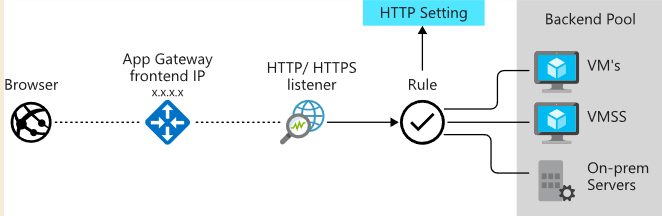
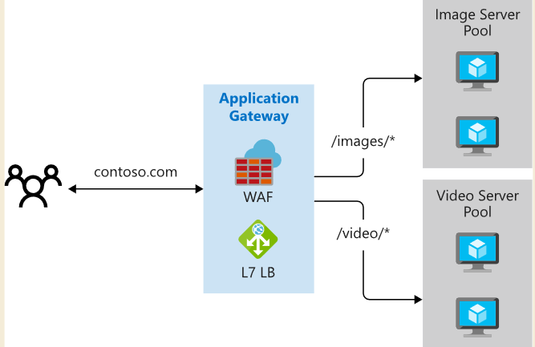
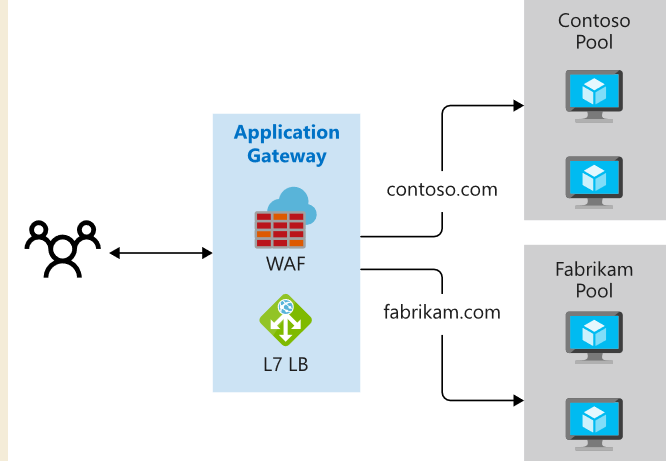
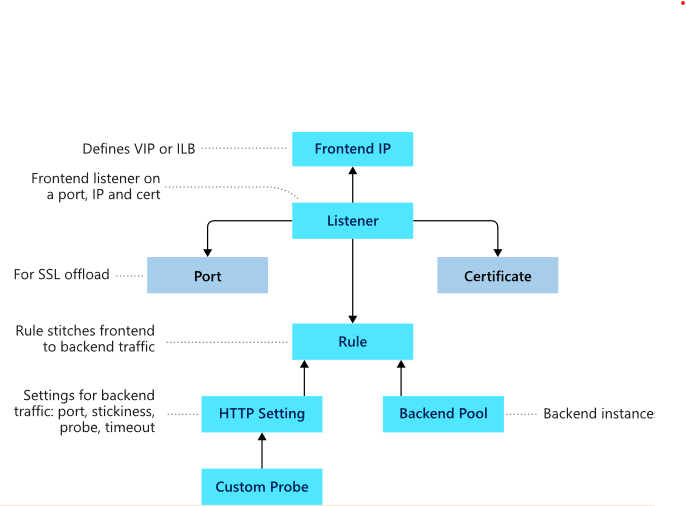

# Application Gateway

## what is application gateway

- Application Gateway routes traffic to a pool of web servers based on the URL of a request. This is known as application layer routing. 
- The pool of web servers can be Azure virtual machines, Azure virtual machine scale sets, Azure App Service, and even on-premises servers.
- application gateway routing method

  1. path-based routing
  
     

  2. multiple sites hosting
  
     
- Redirection 
- Rewrite HTTP headers
- Custom error pages
- Support for the HTTP, HTTPS, HTTP/2 and WebSocket protocols.
- A web application firewall to protect against web application vulnerabilities.
    End-to-end request encryption.
- Autoscaling, to dynamically adjust capacity as your web traffic load changes.

## Load balancing of application gateway

-  load balance requests sent to the servers in each back-end pool using a **round-robin mechanism**. **session stickiness** possible.
  
-  Load-balancing works with the **OSI Layer 7** routing implemented by Application Gateway routing, which means that it load balances requests based on the routing parameters (host names and paths)

## Application gateway structure

- front-end ip 
  
  one public ip and one private ip. no more.

- listeners

  application gateway can have **more than one** listeners. 
  Listeners listens for the **combination of protocol, port, host, and IP address**. Listeners also handle **SSL** certificates
  
  listeners type:
  1. basic
  2. multi-site 
  
- Routing rules
  
  1. how to route from request hostname and path to backend pool.
  2. Protocol (HTTP or HTTPS).
  3. Session stickiness, to pass all requests in a client session to the same web server rather than distributing them across servers with load balancing.
  4. Connection draining, to enable the graceful removal of servers from a back-end pool.
  5. Request timeout period, in seconds.
  6. Health probes, specifying a probe URL, time out periods, and other parameters used to determine whether a server in the back-end pool is available.
   
- Back-end pools.  Each back-end pool has an associated load balancer that distributes work across the pool
  
- Web application firewall(WAF)
  
   An optional component that handles incoming requests before they reach a listener.
   
    SQL-injection

    Cross-site scripting

    Command injection

    HTTP request smuggling

    HTTP response splitting

    Remote file inclusion

    Bots, crawlers, and scanners

    HTTP protocol violations and anomalies

- Health probes
- Autoscale/manual possible
