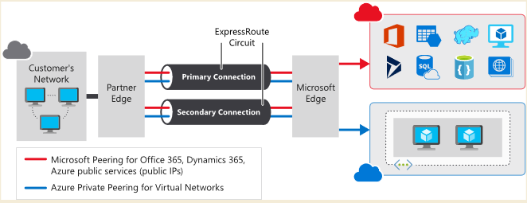
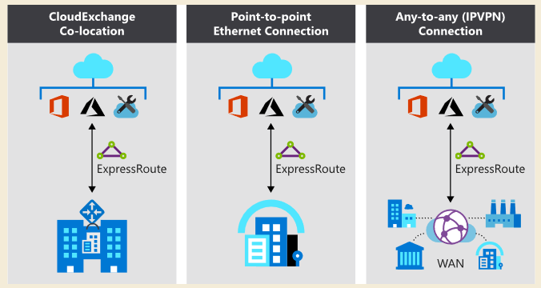

# ExpressRoute

## what is expressRoute

It's a service that provides a direct connection from your on-premises datacenter to the Microsoft cloud. The connection is private.

- private peering is for vnet
- microsoft peering is for office365, dynamics 365 and azure public services (public ips)
- need expressroute partner to set up 
- the connection between microsoft and expressRoute partner is called expressRoute circuit. Circuit is established across a private wire rather than the public internet.
  
## features and benefits of expressRoute

- layer 3 connectivity
- built in redundancy
- Connectivity to Microsoft cloud services
- Across on-premises connectivity with ExpressRoute Global Reach
- Dynamic routing
ExpressRoute uses the Border Gateway Protocol (BGP) routing protocol

## When to use Azure ExpressRoute

- **Low-latency**
  connectivity to services in the cloud. In these situations, eliminating or reducing the network overhead will have a significant impact on the performance of your applications.
  
- Accessing **high-volume** systems in the cloud 
  that consume or produce massive volumes of data quickly. ExpressRoute can move data around rapidly, with high reliability.

- Consuming **Microsoft Cloud Services**, such as **Office 365 and Dynamics 365**. ExpressRoute is especially useful if your organization has **a large number of users** who need to access these services concurrently.

- Organizations that have **migrated large-scale on-premises systems to Azure**. Using ExpressRoute helps ensure that the results of the migrations are seamless for on-premises clients. They should notice no drop in performance. They might even experience some improvement if the previous on-premises systems were restricted by network bandwidth.

- Situations where **data should not traverse the public internet for security reasons**.

- **Large datacenters**, with a high number of users and systems accessing SaaS offerings.

## Benefits of using ExpressRoute
- Predictable performance
- Data privacy for your traffic
- High-throughput, low-latency connections
- Availability and connectivity
  minimum of 99.95 percent availability

## High availability and failover with ExpressRoute
by default two connections are built from provider to microsoft in one region.

### ExpressRoute connectivity models

- CloudExchange co-location (both Layer 2 and Layer 3 )
  
  datacenter is co-located at a internet service provider(ISP).

- Point-to-point Ethernet connection (both Layer 2 and Layer 3)

  on-Premises datacenter to microsoft. 

- Any-to-any connection (Layer 3)
  One datacenter(Wan:wide area network) and multiple site office. datacenter connect to microsoft. 
  

### Security considerations

- private connection. Data not through interenet.
- DNS queries, certificate revocation list checking, and Azure Content Delivery Network requests are still sent over the public internet.