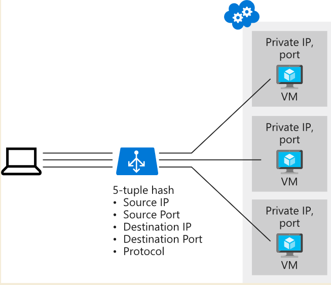
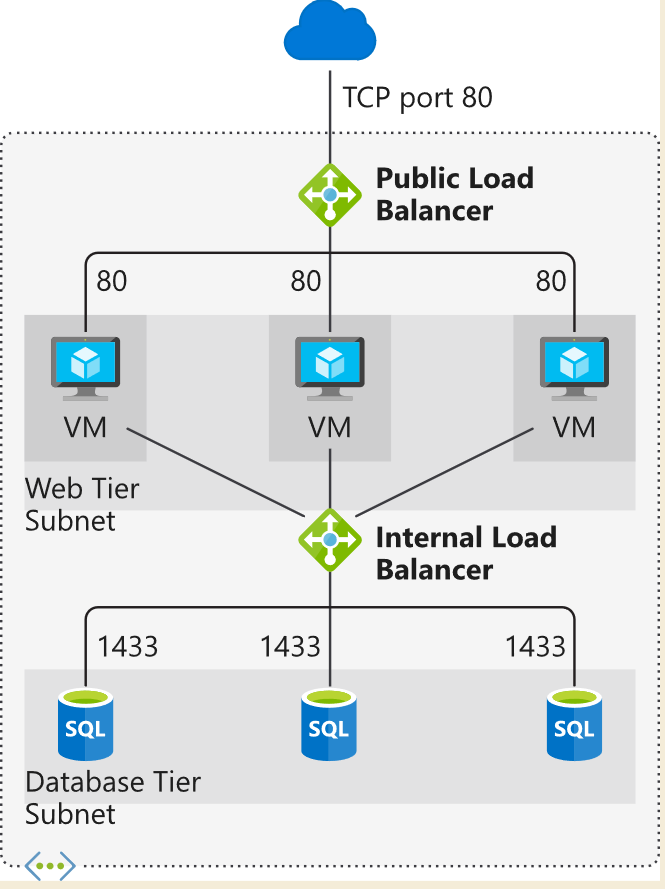

# Load balancer

## load balancer is only for vm

## distribution algorithm

### five-tuple hash (default). 

By default, a five-tuple hash is used to map traffic to available servers. 
The hash is made from the following elements:

- Source IP: The IP address of the requesting client.
- Source port: The port of the requesting client.
- Destination IP: The destination IP of the request.
- Destination port: The destination port of the request.
- Protocol type: The specified protocol type, TCP or UDP.

### Source IP affinity(called also session affinity or client IP affinity)

 - two-tuple hash (from the source IP address and destination IP address) or three-tuple hash (from the source IP address, destination IP address, and protocol type). 
 - The hash ensures that requests from a specific client are always sent to the same virtual machine behind the load balancer.
 - usercases: remote desktop gateway, media upload

## Load Balancer type

### Basic load balancer

- Port forwarding
- Automatic reconfiguration
- Health probes
- Outbound connections through source network address translation (SNAT)
- Diagnostics through Azure Log Analytics for public-facing load balancers
- Basic load balancers can be used only with availability sets.

### standard load balancer

- HTTPS health probes
- Availability zones
- Diagnostics through Azure Monitor, for multidimensional metrics
- High availability (HA) ports
- Outbound rules
- A guaranteed SLA (99.99% for two or more virtual machines)

### internal and external load balancer
- internal: webfront end to database pool.

- external: clients to web server pool

## set up external load balancer

- create load balancer, with public ip, vnet etc
- set up a backend pool say for vm
- create vm
- in the nic of vm link the load balance.

## set up internal load balancer

- same as for external only the load balancer type should be internal. 
- internal load balancer can connect to the vm in same vnet

