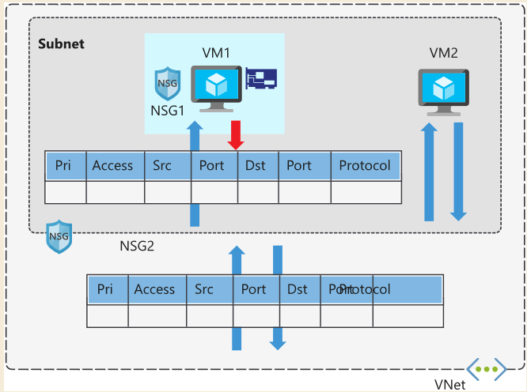
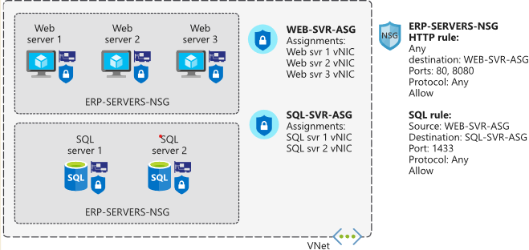
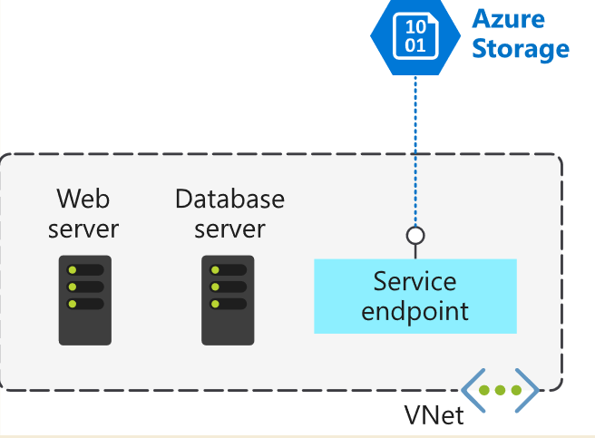
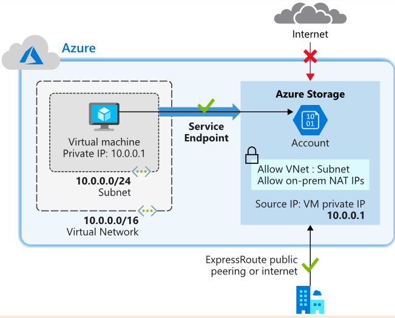

# network security group

## Network security groups(nsg)

- Network security groups filter network traffic to and from Azure resources. You can use network security groups to filter traffic between virtual machines or subnets, both within a virtual network and from the internet.

- nsg could be assigned to network interface or subnet.
  
- nsg evaluation. They are evaluated independently.

   nsg1 is assgined to nic of vm1, nsg2 is assgined to subnet. 
   Inbound traffic is first evaluated by the network security group applied to the subnet, and then by the network security group applied to the network interface. Conversely, outbound traffic from a virtual machine is first evaluated by the network security group applied to the network interface, and then by the network security group applied to the subnet.

  

- Each subnet and network interface can have one network security group applied to it.
  
- Network security groups support TCP, UDP, and ICMP, and operate at Layer 4 of the OSI model.

## Security rules
- Network security group security rules are evaluated by priority, using the 5-tuple information (source, source port, destination, destination port, and protocol) to allow or deny the traffic. 

## Default security rules

### inbound
- Allow inbound coming from any VM to any VM within the subnet.
- Allow traffic from the default load balancer to any VM within the subnet.
- Deny traffic from any external source to any of the VMs. 

### outbound
- Allow outbound going from any VM to any VM within the subnet.
- Allow outbound traffic going to the internet from any VM.
- Deny traffic from any internal VM to a system outside the virtual network.

## Augmented security rules
it is complex rules with options

- multiple IP addresses
- multiple ports
- service tags
- application security groups

## Service tags
Microsoft manages the service tags (you can't create your own).

- VirtualNetwork - This tag represents all virtual network addresses anywhere in Azure, and in your on-premises network if you're using hybrid connectivity.
- AzureLoadBalancer - This tag denotes Azure's infrastructure load balancer. The tag translates to the virtual IP address of the host (168.63.129.16) where Azure health probes originate.
- Internet - This tag represents anything outside the virtual network address that is publicly reachable, including resources that have public IP addresses. One such resource is the Web Apps feature of Azure App Service.
- AzureTrafficManager - This tag represents the IP address for Azure Traffic Manager.
- Storage - This tag represents the IP address space for Azure Storage. You can specify whether traffic is allowed or denied. You can also specify if access is allowed only to a specific region, but you can't select individual storage accounts.
- SQL - This tag represents the address for Azure SQL Database, Azure Database for MySQL, Azure Database for PostgreSQL, and Azure SQL Data Warehouse services. You can specify whether traffic is allowed or denied, and you can limit to a specific region.
- AppService - This tag represents address prefixes for Azure App Service.

## Application security groups

Application security groups let you configure network security for resources used by specific applications. 
You can group virtual machines logically, no matter what their IP address or subnet assignment.
Benefit:
ease to set rule in nsg.

e.g.

inbound
allow source in Application security groups to visit my 1344 port. 

# virtual network service endpoint

## virtual network service endpoint

an endpoint of the azure service for vnet to make this service only accessible in vnet.

Azure service endpoints are available for many services, such as:

- Azure Storage
- Azure SQL Database
- Azure Cosmos DB
- Azure Key Vault
- Azure Service Bus
- Azure Data Lake

## how vnet service endpoint work

- Turn off public access to the service.
- Add the service endpoint to a virtual network.

## use vnet service endpoint to let on-premise network to visit azure storage

