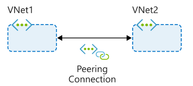

- by default, all sub-vnet in vnet can communicate with each other, to change that, change the network security group.
- by default,the first 3 and first and last ip in subnet is reserved for azure use, according to  https://docs.microsoft.com/en-us/learn/modules/design-ip-addressing-for-azure/4-plan-design-ip-addressing, the number of possible addresses on an Azure subnet is 2^n-5, where n represents the number of host bits. However vm starts with 4 ...
- a vpn gateway subnet is required for vpn connection
- test 
  
  

- Peering types:
  1. Virtual network peering. Connects vnet in same region.
  2. Global virtual network peering connects vnet in different azure region
   
- Reciprocal connections.
  
  	If you want vnet a and b can conect to each other. You have to config two peering. Namely, peeringA from vnet a to vnet b, and peeringB from vnet b to a.

- Cross-subscription virtual network peering. 
  
   Yes, you can. However you need permission(Network  Contributor) in both vnet. 

- Gateway transit. 
   Using gateway transit, you can enable on-premises connectivity without deploying virtual network gateways to all your virtual networks. 
	In hub-spoke structure, Allow gateway transit option in the hub virtual network Also configure the Use remote gateways option in any spoke virtual networks.

- Overlapping address spaces. Not allowed.
  
- When to use. When u want to connect two vnet. 
  
Peering might not be your best option if you have existing VPN or ExpressRoute connections or services behind Azure Basic Load Balancers that would be accessed from a peered virtual network. In these cases, you should research alternatives.
