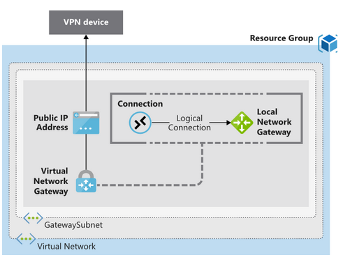
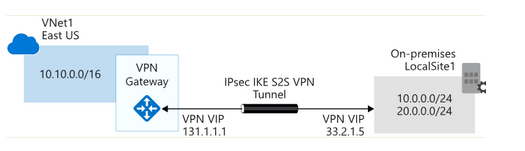

# vpn Gateway

## only one VPN gateway in each virtual network 
## Resource needed for deployment of vpn Gateway 

### Azure resource 

- Vnet
- GatewaySubnet. at least /27 address needed. This subnet cannot be used for any other devices.
- public ip address. Basic dynamic. It will not change if u delete and re-create vpn gateway
- local network gateway for On-premises VPN device's public IPv4 address and the on-premises routable networks
- Virtual network gateway. It is vpn gateway.
- Connection.You can create multiple connections. 
  
### on-premise resource

- vpn device
- public ip

## High availability scenarios 

- Active/standby(default model) 
- Acitve/active(high availability) 
- ExpressRoute failover(ExpressRoute as main tunnel,vpn as failover) 
- Zone-redundant gateways(Standard public IP addresses) 

## VPN gateway sizes 

it is depending on sku,maximum 1.25G and 30 tunnels. 

 ## Authentication

 Azure use pre-shared key as the only method of authentication. Both types also rely on Internet Key Exchange (IKE) in either version 1 or version 2 and Internet Protocol Security (IPSec)

## Contection types: 

- site-to-site 
- Point-to-site 
- Network-to-network(between azure vnet) 

## vpn Type

###     Policy-based vpn 

- Support for IKEv1 only 
- Use of static routing. 
- compatibility with legacy on-premises VPN devices 

###     Route-based vpn 

- Route-based VPNs are the preferred connection method for on-premises devices. They more resilient to topology changes. 
- Use when Connections between virtual networks,Point-to-site connections, Multisite connections, Coexistence with an Azure ExpressRoute gateway 
- Supports IKEv2. 
- Uses any-to-any (wildcard) traffic selectors 
- Can use dynamic routing protocols. 