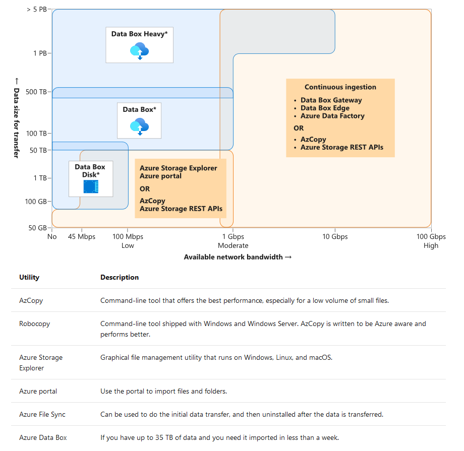
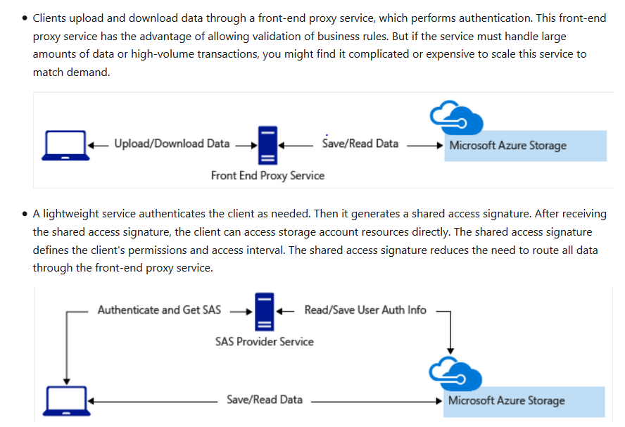

# storage

## data types
- Structured data (like data in ralational db)
- Semi-structured data (like json,xml, yaml, e.g. Product catalog data)
- Unstructured data (like files, images videos)

## no-sql db types
- key-value databases (key value pair)
- graph databases (nodes pointing to each other)
- Document databases (store json, xml and so on)

## determine operational needs

- Will you be doing simple lookups using an ID?
- Do you need to query the database for one or more fields?
- How many create, update, and delete operations do you expect?
- Do you need to run complex analytical queries?
- How quickly do these operations need to complete?

## What is a transaction?
Transactions are often defined by a set of four requirements, referred to as ACID guarantees. **ACID** stands for Atomicity, Consistency, Isolation, and Durability:

- Atomicity means a transaction must execute exactly once and must be atomic; either all of the work is done, or none of it is. Operations within a transaction usually share a common intent and are interdependent.
- Consistency ensures that the data is consistent both before and after the transaction.
- Isolation ensures that one transaction is not impacted by another transaction.
- Durability means that the changes made due to the transaction are permanently saved in the system. Committed data is saved by the system so that even in the event of a failure and system restart, the data is available in its correct state.

## OLTP vs OLAP

- **OLTP** (Transactional databases)  OLTP systems commonly support lots of users, have quick response times, and handle large volumes of data. They are also highly available (meaning they have very minimal downtime), and typically handle small or relatively simple transactions.

-  **OLAP** (Online Analytical Processing) systems commonly support fewer users, have longer response times, can be less available, and typically handle large and complex transactions.

## one use case

### Product catalog data

**Data classification**: Semi-structured because of the need to extend or modify the schema for new products

**Operations:**

- Customers require a high number of read operations, with the ability to query on many fields within the database.
- The business requires a high number of write operations to track the constantly changing inventory.
  
**Latency & throughput:** High throughput and low latency

**Transactional support:** Required

**Recommended service:** Azure Cosmos DB

## what is azure storage account
A storage account is a container that groups a set of Azure Storage services together.

Azure Storage services:
- Azure Blobs
- Azure Files
- Azure Queues
- Azure Tables

azure blobs:

- **Block blobs**: Block blobs are used to hold text or binary files up to ~5 TB (50,000 blocks of 100 MB) in size. The primary use case for block blobs is the storage of files that are read from beginning to end, such as media files or image files for websites. They are named block blobs because files larger than 100 MB must be uploaded as small blocks, which are then consolidated (or committed) into the final blob.
- **paged blobs**:Page blobs are used to hold random-access files up to 8 TB in size. Page blobs are used primarily as the backing storage for the VHDs used to provide durable disks for Azure Virtual Machines (Azure VMs). They are named page blobs because they provide random read/write access to 512-byte pages.
-  **Append blobs**:Append blobs are made up of blocks like block blobs, but they are optimized for append operations. These are frequently used for logging information from one or more sources into the same blob. For example, you might write all of your trace logging to the same append blob for an application running on multiple VMs. A single append blob can be up to 195 GB.


azure Files:

- Azure Files could be visited via SMB(standard server message block) or rest or client libs.
- Azure files could be accessed directly(SMB no code change) or view file sync(slow internet connection).
- Azure file migration.
  


Queues:
Queue messages can be up to 64 KB in size


  
Azure Storage kinds:
- StorageV2 (general purpose v2): the current offering that supports all storage types and all of the latest features. Pricing for GPv2 accounts has been designed to deliver the lowest per gigabyte prices.
- Storage (general purpose v1): a legacy kind that supports all storage types but may not support all features. For example, cool storage and archive storage are not supported in GPv1. Pricing is lower for GPv1 transactions, so workloads with high churn or high read rates may benefit from this account type.
- Blob storage: a legacy kind that allows only block blobs and append blobs

Deployment model:

- Resource Manager: the current model that uses the Azure Resource Manager API
- Classic: a legacy offering that uses the Azure Service Management API


important Storage account settings:
- name: The name of a storage account must be globally unique.
- Subscription
- location
- performance:
  1. standard: magnetic disk drivers(HDD),Double-digit ms latency, 10,000 IOPS, 300-MBps bandwidth
  2. Premium: ssd, Single-digit ms latency, 100,000 IOPS, 5-GBps bandwidth
- Replication (same inside a storage account and could be changed after storage account creation)
  1. LRS: locally-redundant storage.(against hardware failure)
  2. GRS: geo-redundant storage. (repli accross datacenter)
  3. ra-grs: read access geo-redundant storage
- access tier
  1. hot
  2. cool
- Secure transfer required (supported protocols)
- virtual network.(service as endpoint)

security in storage account:

- Encryption at rest.
  
  All data written to Azure Storage is automatically encrypted by Storage Service Encryption (SSE) with a 256-bit Advanced Encryption Standard (AES) cipher. 

- Encryption in transit (https/SMB 3.0)
- CORS support
- Role-based access control. (via azure ad)
- Storage account access key. (two keys)
  
  e.g. use it in http header
  ```http
  Authorization: SharedKey myaccount:CY1OP3O3jGFpYFbTCBimLn0Xov0vt0khH/E5Gy0fXvg=  
  ```
  you shouldn't share storage account keys with external third-party applications, always for in house app.

- shared access signatures(SAS). for external client to access storage. 
  1. service level
  2. account level
  3. two sample design for using sas.
   
- newwork access restriction
  allow all by default. config setting in firewalls and virtual networks.
- Advanced Threat Protection. anomalies in account activities and notifies you of potential harmful attempts to access your account


## what is storage explorer

**benefits**:

- It's easy to connect to and manage multiple storage accounts.
- The interface lets you connect to Azure Cosmos DB and Data Lake.
- You can also use the interface to update and view entities in your storage accounts.
- Storage Explorer is free to download and use.
- Manage multiple storage accounts in multiple subscriptions
- Use as local emulators
  1. uses ms sql express 2012 to emulates azure table, queue and blob
  2. Azurite, it is for nodejs
- Connection types
  1. Add resources by using Azure Active Directory (Azure AD)
  2. Use a connection string
  3. Use a shared access signature URI
  4. Use a name and key
  5. Attach to a local emulator
  6. Attach to Azure Cosmos DB through a connection string
  7. Attach to Azure Data Lake by using a URI

## manual failover in westus2 and centralUS region possible. Other regions not available.
```bash
az storage account failover --name "storageaccountname"

```

## Circuit Breaker pattern and Retry pattern(TODO: implement it in code)

An application that uses the Azure Storage client library can set the LocationMode of a read request to one of the following values:

- PrimaryOnly: The read request fails if the primary location is unavailable. This failure is the default behavior.
- PrimaryThenSecondary: Try the primary location first, and then try the secondary location if the primary location is unavailable. Fail if the secondary location is also unavailable.
- SecondaryOnly: Try only the secondary location, and fail if it's not available.
- SecondaryThenPrimary: Try the secondary location first, and then try the primary location.


The Circuit Breaker pattern forces the application to fail over to the secondary site, which allows the application to resume its normal service. At the same time, the circuit breaker continues to check on whether the resources on the primary site are back online. And when they do come online, it allows the application to reconnect to the primary site. The circuit breaker acts as a proxy. It monitors the service, and if there's a failure in the service, it prevents the application from retrying that endpoint and forces it to go to an alternative endpoint.

The difference between the Circuit Breaker pattern and the Retry pattern is that the Retry pattern allows an application to keep retrying a connection to a resource, which might be offline. The Circuit Breaker pattern prevents this behavior and fails over the application to the secondary connection.

When you implement the Circuit Breaker pattern, set the LocationMode of read requests appropriately. Most of the time, you should set this mode to PrimaryThenSecondary. If the read from the primary location times out, the secondary location is used. However, this process can slow down an application if it's done repeatedly. After the circuit breaker has detected that the primary location is unavailable, it should switch the mode to SecondaryOnly. This action ensures that read operations don't wait for a timeout from the primary location before trying the secondary location. When the circuit breaker estimates that the primary location has been repaired, it can revert back to the PrimaryThenSecondary mode.

## Disk

**Disk roles:**
- os disk
- data disk
- temprary disk
  
disk types:

- Ephemeral OS disks faster read-write than managed disks. host stateless workload. 

- Managed disks. like for vm. stored as page blobs,but you don't have to create storage accounts, blob containers, and page blobs yourself or maintain this infrastructure later.Benefits of managed disks:
  1. Simple scalability. up to 50000 in each region in ur subscription
  2. High availability. 99.999% availability by storing data three times
  3. Integration with availability sets and zones. 
  4. Support for Azure Backup.
  5. Granular access control. role-based access control (RBAC) to grant access to specific user accounts
  6. Support for encryption. Azure Storage Service Encryption (SSE),which is from azure storage account. Azure Disk Encryption (ADE), which uses BitLocker for Windows virtual machines, and DM-Crypt for Linux virtual machines.
- Unmanaged disks. stored as page blob. you create and maintain this storage account manually.

Disk performance measures:

- **Input/output operations per second (IOPS)**. IOPS measure the rate at which the disk can complete a mix of read and write operations. Higher performance disks have higher IOPS values.
- **Throughput.** Throughput measures the rate at which data can be moved onto the disk from the host computer and off the disk to the host computer. Throughput is also called data transfer rate and is measured in megabytes per second (MBps). Higher performance disks have higher throughput.

disk physical holder: 

- Ultra SSD(only for data disk)
  
1. They're only available in a subset of Azure regions.
2. They can only be attached to virtual machines that are in availability zones.
3. They can only be attached to ES/DS v3 virtual machines.
4. They can only be used as data disks and can only be created as empty disks.
5. They don't support disk snapshots, virtual machine images, scale sets, Azure Disk Encryption, Azure Backup, or Azure Site Recovery.

- Premium SSD
- Standard SSD (These performance figures aren't guaranteed but are achieved 99% of the time.)
- Standard HDD (you want to minimize costs for less critical workloads and development or test environments.)